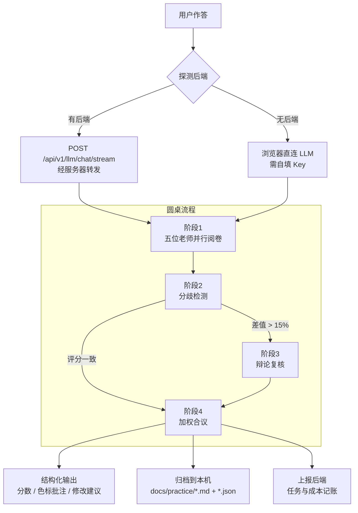

# 蓝笔申论 BluePencil

> 输入一篇作答 → 五位申论名师各按自己的方法论独立阅卷 → 分歧自动复核 → 圆桌合议出一份综合批改


---

## 目录

- [项目简介](#项目简介)
- [核心特性](#核心特性)
- [五位阅卷老师](#五位阅卷老师)
- [评分内核](#评分内核)
- [技术栈](#技术栈)
- [系统架构](#系统架构)
- [设计风格](#设计风格)
- [快速开始](#快速开始)
- [项目结构](#项目结构)
- [API 一览](#api-一览)
- [三种打包产物](#三种打包产物)
- [做个桌面版发给别人](#做个桌面版发给别人)
- [开发验证工具](#开发验证工具)
- [常见问题](#常见问题)
- [上线部署](#上线部署)
- [作者与开源](#作者与开源)
- [微信与社区](#微信与社区)
- [免责声明](#免责声明)

---

## 项目简介

市面上的申论 AI 批改基本都是「一个模型、一条流水线、一个分数」——你写什么它都给你打 70 分，理由说得很像那么回事，但换个模型结论就变了。

蓝笔申论换了个思路：**不模拟一个老师，而是模拟一场阅卷**。

五位申论老师（袁东、周泰然、白鹭、Kiwi、李崇立）各有自己的一套方法论，每人的原始讲义都完整内置在程序里。系统把讲义提炼成**专属批改指令**，让五位老师从不同角度切进去批同一份作答：

- **袁东**盯采分词有没有踩准
- **周泰然**盯要点有没有按材料逻辑拆对
- **白鹭**盯形式有没有回应问法
- **Kiwi**盯分类有没有做到互斥穷尽
- **李崇立**盯表述有没有被自编词替换掉原词

因为是五套不同的评判标准，**分数会真的分歧**——分歧本身就是有价值的信息。三个及以上老师同时阅卷时，系统会检测分歧、触发复核辩论，最后合议出一份综合结论。

---

## 核心特性

**用户自选阅卷组合（1~5 人）**
单人快速批改、双人联合评定、三人以上圆桌合议，适配不同阶段：日常刷题用单人，专项强化用双人，模考复盘用圆桌。

**分歧检测与圆桌辩论**
并行阅卷后自动比对得分率，差值超过 15% 触发二次复核。注意：**不是每次都辩论**——只有真分歧才复核，评分一致时直接进合议，这既省 token 又让辩论结果有信息量。

**加权合议**
按老师的评审侧重分配权重（客观采分派权重最高），融合各方结论，剔除片面评价与极端分数。

**分数不是黑盒：采分点锚点 + 客观校验**
每道题可预置一份**采分点标准**（分值、材料原文依据、判据关键词），批改时同时注入五位老师——老师有了共同锚点，分数才可比、可复算，而不是各凭感觉。金额之外还有一层**纯代码的硬规则校验**（字数、标点格式、结构分条、重复与照抄），不交给模型"感觉"：字数差了多少、有没有整段抄材料，这类板上钉钉的结论由规则给出。练习页因此多两块面板——「客观校验」列出问题与改法，「采分点对照」给出覆盖率与逐点命中情况。**没有录标准的题照旧能批改**，只是少了这层锚点。

**先答题，再批改；每位老师一种颜色**
答题页是沉浸式单栏，答完了才进入批改。结果页把各老师的逐句批注按**各自颜色**标在作答原文上——同一句被多位老师标中时，下划线按人数分段着色，悬停可看全部意见；每位老师另给一段「如果只改一处先改哪里」的修改建议。

**每日一练：进页面就有题有材料**
打开练习页会自动载入当天的题目（题目 + 给定资料 + 作答要求 + 分值 + 字数限制一并到位），不用自己去别处找题再手抄一遍。选题是**确定性**的（按本地日期散列），同一天刷新多少次都是同一道；旁边「换一题」可随机切换，「从题库选题」可搜索挑选。首页也有今日一练入口。

**内置题库与文章库**
31 篇官媒时评（约 9.5 万字，覆盖 9 个主题）开箱即用；题库含 **15 道完整题目，覆盖五种题型**（归纳概括 / 综合分析 / 提出对策 / 贯彻执行 / 大作文），每题都带**完整给定资料与参考答案**，材料按「材料1 / 材料2」分则渲染。支持上传文件 / 选整个文件夹批量导入、JSON 文章包导入导出。

> 题库里的材料是**按真题命题风格自编的仿真材料**（题型、材料结构、数据密度对齐真题），不是官方真题原文——界面会明确标注「仿真」。需要真题原文用「录入题目」自行补充。

**记录归档，随时复盘**
每次批改会落成 `docs/practice/` 下一对文件：`.md` 给人读（VSCode / Typora 直接打开），`.json` 给程序读（复盘页据此还原色标）。**离线也能用**——后端不在时退回浏览器 IndexedDB，两边都有时按 id 合并去重。

**方法论透明可查**
「老师」页可以读每位老师的完整讲义原文，也能看到 AI 实际收到的系统提示——不存在黑盒。

**双运行通道，自动切换**
有后端时请求经服务器转发（跨域消失、Key 可服务端统一配置）；没有后端时退化为浏览器直连。**同一套代码，既能当网站跑，也能打包成一个 HTML 文件发给别人双击即用。**

**本地优先，无账号体系**
作答、笔记、错题存在浏览器 IndexedDB，批改记录归档到本机 `docs/`。后端只记录任务级指标（模式、分数、耗时、token），不做用户体系、不需要注册登录。

**更新日志与仓库入口**
GitHub / Gitee / 更新日志三个入口常驻在**左侧边栏底部**（原先只在首页页脚，别的页面够不着），侧边栏最下方另有一行作者署名。首页页脚是「作者与开源」信息块。「更新日志」页按版本列出每轮改动（新增 / 优化 / 变更 / 修复 / 删除分色标注）。仓库地址与日志数据统一在 `frontend/src/data/site.js`，改地址只改一处。

**容易找到作者：微信入口铺在需要的地方**
侧边栏底部、首页作者区、设置页「关于」、题库页「怎么获取私有题库」，四处都有加微信 / 进交流群的入口。前两处开统一弹层（ESC 可关），后两处直接摊开二维码——那两个位置用户本来就是在找联系方式，不必多点一次。**群二维码到点自动降级**成「已过期，加微信拉你进群」，不展示一张扫了没用的图。

---

## 五位阅卷老师

| 老师 | 流派 | 评审侧重 | 权重 |
|---|---|---|---|
| 袁东 | 按词给分派 | 采分词：动词 + 事情、原词覆盖、宁滥毋缺 | 1.2 |
| 周泰然 | 材料逻辑派 | 要点处理：抄词不抄句、拆点、贴合材料 | 1.1 |
| 白鹭 | 应题意识派 | 应题形式：形式是否回应问法、前置提炼 | 1.0 |
| Kiwi | 框架体系派 | 分类逻辑：MECE、分类维度、层次清晰 | 1.0 |
| 李崇立 | 实用踩点派 | 表述规范：材料原词优先、多写不扣分 | 0.9 |

> 五位老师的讲义原文存放在 `frontend/src/data/teachers/*.md`，会在「老师」页按需懒加载展示。
> 讲义本身带有使用约定（以 AI 身份回答、不冒名、引述方法时加前缀），程序在组装 Prompt 时如实执行。

---

## 评分内核

AI 批改最容易失去可信度的地方是：**换个模型分数就变了，谁也说不清为什么**。
这里的做法是把「评分」拆成五层，**能确定性算出来的就绝不交给模型**：

| 层 | 由谁负责 | 产出 | 状态 |
|---|---|---|---|
| ① 题目标准层 | 人工 / 预解析，**固定复用** | 采分点（分值 · 材料原文依据 · 判据关键词） | 已完成 |
| ② 模型阅卷层 | 五位老师各自独立 | 分数 + 逐句批注 + 修改建议 | 已完成 |
| ③ 纯代码校验层 | `utils/grading/rules.js`，零依赖 | 字数 / 格式 / 结构 / 重复照抄的客观结论 | 已完成 |
| ④ 合议层 | 分歧检测 → 辩论 → 加权合议 | 综合分数与结论 | 已完成 |
| ⑤ 训练层 | 待建 | 依据历史记录给出针对性练习 | 未开始 |

**① 采分点标准层**（`agents/grading/standard.js` + `standardResolver.js`）
给题目预先备一份采分点标准，批改时注入每位老师的提示词。老师有了**共同锚点**，评分才可比、可复算。
标准可以批量预解析（`.tools/standards/gen_standards.mjs`，`--mock` 无 Key 也能跑通链路），
也可以人工精校——`data/standards/public.js` 里收了一道人工精校的样板，作为格式参照与质量基线。
**有标准更好，没有标准照旧裸判**，不会因为一道题没录标准就罢工。

**③ 纯代码校验层**（`utils/grading/rules.js`）
字数、标点格式、结构分条、重复与照抄四类校验，纯代码、可复算。客观扣分默认**封顶为满分的 20%**，
且**只作旁证、不直接改写 AI 分数**——规则负责指出"板上钉钉"的问题，改不改由合议层判断。
它的结论还会作为「客观事实」注入辩论与合议的输入，避免「字数明显不足」这类问题在合议里无人提及。

**数据分层**：公开卷与仿真题的标准在 `data/standards/`（进仓库）；
私有卷的标准在 `data/standards-private/`（**已 gitignore**，走 `@private-standards` 别名）——
**写出采分点等于泄题**，必须和私有卷正文一起隔离。

**校准方式**：评分逻辑不靠"读代码觉得对"，而是靠两端夹住——
`backend/tests/` 的接口冒烟 + `.tools/test-rules.mjs`（24 组断言）、`.tools/test-standards.mjs`（17 组断言）
两组纯代码单测，以及 `.tools/probe-standard-panel.mjs` 的面板渲染验证。

---

## 技术栈

**前端**

| 依赖 | 版本 | 用途 |
|---|---|---|
| Vue | 3.5 | `<script setup>` 组合式 API |
| Vue Router | 5.x | **hash 模式**——单文件版用 `file://` 打开也能正常路由 |
| Vite | 8.3 | 开发服务器 + 双产物构建 |
| Tailwind CSS | 3.4 | 工具类（`@tailwind` 三行指令在 `style.css` 顶部） |
| ECharts | 6.1 | 五维雷达图与趋势统计 |
| vite-plugin-singlefile | 2.3 | 单文件产物 |

> 提示/确认框是自己实现的（`utils/toast.js` + `components/ToastHost.vue`，约 120 行）。
> 早先只用到一个 UI 库的 `Message` 和 `Modal` 两个 API，却为此背上 460KB 的 `arco.css`——
> 实测打包后 CSS 的 gzip 体积与 `arco.css` 单独 gzip **只差 77 字节**，等于样式产物全是它。
> 现在换成自实现，CSS 从 405KB 降到 24KB。

**后端**

| 依赖 | 用途 |
|---|---|
| FastAPI + Uvicorn | 异步 Web 框架 |
| SQLAlchemy 2.0 (async) + aiosqlite | 零配置 SQLite，`ENABLE_PERSISTENCE` 可一键关闭 |
| httpx | 直连 OpenAI 协议接口，**不引入 langchain**，依赖更轻 |
| pydantic-settings + loguru | 配置与日志 |

---

## 系统架构



**通道自动切换逻辑**：前端启动时探测 `/api/v1/health`，通则全程走后端；失败则退回直连，并在运行期一旦发现后端不可达就立即降级，不阻塞用户。

**为什么后端只做网关、不做 Prompt 组装？**
Prompt 的唯一来源是前端 `src/agents/`。如果后端再实现一遍，两边必然出现不一致——查问题时不知道该信哪份。所以后端职责收得很窄：**安全转发、并发调度、记账**。

---

## 设计风格

界面走 **Natural Organic（自然有机风）**：暖米底、胡桃棕主色、鼠尾草绿点缀、衬线标题、
大圆角与纸质感。选它不是为了好看——暖色久看不累，纸张意象也贴合「申论 = 纸笔写作」的心理预期。

**所有颜色都走语义 token，不在业务代码里写十六进制。** 定义在 `frontend/tailwind.config.js` 的
`theme.extend.colors.c` 下，前缀 `c-` 避免与 Tailwind 内置的 `stone` / `amber` 冲突：

| token | 值 | 用途 |
|---|---|---|
| `c-cream` | `#faf6f1` | 页面底色 |
| `c-paper` | `#fffdfb` | 纸面（输入框、方格纸） |
| `c-bark` | `#5c4033` | 主色：胡桃棕 |
| `c-barkSoft` | `#f2ebe2` | 主色极浅底（导航选中态） |
| `c-sage` | `#8b9d77` | 鼠尾草绿：成功 / 建议 |
| `c-tan` | `#d4a373` | 暖褐：次强调 |
| `c-clay` | `#b4552d` | 陶土：警示 / 超字数 |
| `c-ink` / `c-body` / `c-muted` | `#1c1917` / `#44403c` / `#78716c` | 标题 / 正文 / 次要文字 |

`style.css` 里那几个 `.neu*` 工具类**名字保留、定义换掉了**——它们现在是「暖米底 + 1px 描边 + 极轻纸感阴影」，
不再是双向阴影。这样做的原因：换肤前全项目有 161 处 `neu-*` 调用点，
保留类名意味着这些调用点自动跟随，不必逐个改类名（否则每处都要改，且极易漏）。

老师色标是**功能性例外**：五位老师需要 5 种可区分的颜色，纯大地色系区分度不够。
所以取「扩展大地色相」——深湖蓝 / 苔绿 / 赤陶红 / 藕紫 / 赭黄，
明度与饱和度都压低以融入暖调，但色相拉开以保证辨识度。

---

## 快速开始

### 环境要求

| 项目 | 版本 | 说明 |
|---|---|---|
| Node.js | 20.19+ / 22+ | Vite 8 要求，前端必需 |
| Python | 3.11+ | 后端可选，不装也能用（走直连）。开发环境用的是 3.13 |
| LLM API Key | — | 任意 OpenAI 协议兼容服务（DeepSeek / 通义 / 智谱 / OpenRouter） |

### 端口约定（重要）

| 服务 | 端口 | 为什么不是默认值 |
|---|---|---|
| 前端 dev server | **5273** | 默认的 5173 常被其他项目占用 |
| 后端 API | **8100** | 默认的 8000 常被 `resumatch-ai` 占用 |

两个项目抢同一个端口时，**后启动的那个会静默 bind 失败**，而前端代理照常工作——于是请求全被打到另一个项目上，症状看起来像「代码 bug」。所以本项目两个端口都选了非默认值，并在 `vite.config.js` 里开了 `strictPort`：端口被占直接报错，而不是静默换号。

### 1. 启动后端（可选，但建议）

```bash
cd backend

# 创建虚拟环境
python -m venv .venv
.venv/Scripts/activate        # Windows
# source .venv/bin/activate   # macOS / Linux

pip install -r requirements.txt
cp .env.example .env          # 按需填 LLM_API_KEY

python run.py                 # 等价于 uvicorn app.main:app --reload --port 8100
```

启动后访问 `http://127.0.0.1:8100/docs` 查看交互式 API 文档。

`run.py` 会在启动前做两项自检，把两种最常见的坑直接说清楚：

1. **解释器选错**——比如在 PyCharm 里用了 Anaconda 的环境，缺 `sqlalchemy` 时会明确告诉你应该切到 `backend/.venv/Scripts/python.exe`
2. **端口被占**——会打印占用进程的 PID 和对应的 `taskkill` 命令；如果占端口的就是本项目后端，则提示「已在运行」并以退出码 0 结束

> 不装后端也能跑——前端会自动退回浏览器直连模式，只是需要在设置页自己填 Key。

### 跑测试

```bash
cd backend && .venv/Scripts/python.exe -m pytest    # 19 passed
```

也可以直接在仓库根跑 `python -m pytest`——`pytest.ini` 放在仓库根就是为了让**任何目录下跑结果都一致**。

> 配置若只放 `backend/pytest.ini`，从仓库根裸跑 `pytest` 时它不会被加载，`asyncio_mode=auto` 丢失，
> 所有异步用例会报 `requested an async fixture ... with no plugin or hook`——看着像代码坏了，其实只是配置没读到。

### 2. 启动前端

```bash
cd frontend
npm install
npm run dev
```

访问 `http://localhost:5273`。Vite 已配置 `/api` 代理到 `127.0.0.1:8100`，无需额外处理跨域。

### 3. 配置模型

打开「设置」页：

- **走服务端通道**（页面顶部显示绿点）：Key 可以留空，由后端 `.env` 统一配置
- **走本地直连**（灰点）：必须填自己的 API 地址、Key、模型名

内置三个服务商预设（DeepSeek / 智谱 GLM / OpenAI），点一下即可填好地址与模型名。Base URL 三种写法都能识别：只填域名、`.../v1`、`.../paas/v4`（智谱）、甚至完整的 `.../chat/completions`。

---

## 项目结构

```
bluepencil/
├── backend/
│   ├── app/
│   │   ├── main.py                 # FastAPI 入口、路由注册、CORS、生命周期、托管前端
│   │   ├── core/
│   │   │   ├── config.py           # pydantic-settings；打包后路径解析、config.json 预置
│   │   │   └── db.py               # 异步引擎、Session、连接池
│   │   ├── models/
│   │   │   ├── entities.py         # GradingTask / LLMCallLog
│   │   │   └── schemas.py          # 出入参模型
│   │   ├── api/v1/
│   │   │   ├── health.py           # 健康检查（前端靠它判断通道；含 desktop 标志）
│   │   │   ├── llm.py              # LLM 网关：单次 / 流式 / 批量并发
│   │   │   ├── grading.py          # 批改任务记录与历史
│   │   │   ├── records.py          # 练习记录归档（读写 docs/practice/）
│   │   │   ├── stats.py            # 成本与用量统计
│   │   │   ├── settings.py         # 模型连通性测试 + 服务端托管配置查询
│   │   │   └── session.py          # 桌面版会话登记：hello / ping / bye / state
│   │   ├── services/
│   │   │   ├── llm_service.py      # httpx 调用、重试退避、并发限流
│   │   │   ├── grading_service.py  # 落库与统计聚合
│   │   │   ├── record_service.py   # 记录渲染：结构化数据 → Markdown
│   │   │   └── session_watch.py    # 桌面版看门狗：页面全关了就结束进程
│   │   └── agents/llm.py           # LLM 配置解析、URL 拼接、请求体构造
│   ├── assets/                     # icon.svg（图标源）+ icon.ico（make_icon.py 生成）
│   ├── data/                       # SQLite 数据库（启动自动生成）
│   ├── tests/                      # conftest.py（临时库隔离）+ 19 项用例
│   ├── desktop.py                  # 桌面版入口：选端口 → 起服务 → 开浏览器（支持 --port N）
│   ├── build_desktop.py            # 一键打包成可分发的桌面版压缩包
│   ├── make_icon.py                # SVG → 多尺寸 ICO（用 Chrome 无头渲染）
│   ├── release_utils.py            # 打包脚本共用的安全清理函数
│   ├── requirements.txt
│   └── run.py                      # 开发用：python run.py（启动前自检）
│
├── frontend/
│   ├── src/
│   │   ├── main.js                 # 挂载 Vue + Router
│   │   ├── App.vue                 # 左侧分组侧边栏 + 通道状态指示
│   │   ├── router/index.js         # 9 条 hash 路由
│   │   ├── style.css               # Tailwind 指令 + 自然有机风 token 与工具类
│   │   ├── api/
│   │   │   ├── llm.js              # 双通道入口：自动选后端或直连
│   │   │   └── backend.js          # 后端探测、任务上报、记录归档读写
│   │   ├── agents/
│   │   │   ├── teachers.js         # 五位老师的角色定义与专属批改指令
│   │   │   ├── skills.js           # Prompt 组装（含深度模式、辩论、合议、批注契约）
│   │   │   ├── grading/
│   │   │   │   ├── standard.js     # 采分点标准层：结构定义与格式化注入
│   │   │   │   └── standardResolver.js # 按题目 id 解析该题标准（有则用，无则裸判）
│   │   │   └── orchestrator.js     # 圆桌调度：并行阅卷 → 分歧检测 → 辩论 → 合议
│   │   ├── prompts.js              # 追问与范文生成的 Prompt
│   │   ├── bpq/
│   │   │   ├── importer.js         # .bpq 题库包：解析 / 校验 / 解密验签 / 入库
│   │   │   ├── crypto.js           # v2 的加解密与签名（作者侧脚本 import 同一份）
│   │   │   └── pubkey.js           # 验签公钥，由 bpq-keygen.mjs 写入（公钥本就该公开）
│   │   ├── utils/
│   │   │   ├── fileDrop.js         # 整页拖拽接收文件（.bpq 拖进窗口就能导入）
│   │   │   └── grading/
│   │   │       └── reviewCard.js   # 复盘卡 + 短板统计（共识优先排序，纯代码可复算）
│   │   ├── data/
│   │   │   ├── author.js               # **作者信息唯一来源**（署名 / 邮箱 / 仓库 / 许可）
│   │   │   ├── builtin-articles.json   # 内置 31 篇时评
│   │   │   ├── builtin-questions.js    # 内置 15 道题（含完整材料与参考答案，标注为仿真）
│   │   │   ├── error-taxonomy.js       # **错误类型统一口径**（V3 聚合的地基）
│   │   │   ├── questions.js            # 题库统一入口：仿真 + 公开真题 + 私有真题
│   │   │   ├── real-exams/             # 公开真题（2010–2021，自动生成，进仓库）
│   │   │   ├── real-exams-private/     # 私有真题（2022 起，自动生成，**已 gitignore**）
│   │   │   ├── real-exams-private-stub/ # 私有卷空实现：别人 clone 后构建走它
│   │   │   ├── standards/              # 公开卷 / 仿真题的采分点标准（进仓库）
│   │   │   │   ├── public.js           #   人工精校的样板（数字乡村建设）
│   │   │   │   └── generated.js        #   gen_standards.mjs 批量预解析的产物
│   │   │   ├── standards-private-stub/ # 私有卷标准的空实现（走 @private-standards 别名）
│   │   │   ├── daily.js                # 每日一练选题：按本地日期散列，确定性出题
│   │   │   ├── site.js                 # 仓库地址与产品名（转发 author.js）
│   │   │   ├── wechat.js               # 微信二维码与群码有效期（唯一来源，图片走 import）
│   │   │   ├── changelog.js            # 读入仓库根 CHANGELOG.md（只做 ?raw 引入与转发）
│   │   │   ├── changelog-parse.js      #   CHANGELOG 解析器（纯函数，单测直接 import 这一份）
│   │   │   └── teachers/*.md           # 五位老师讲义原文（?raw 懒加载）
│   │   ├── views/                  # 首页/老师/文章库/题库/练习批改/复盘/统计/设置/更新日志
│   │   ├── components/
│   │   │   ├── GroupedSidebar.vue  # 分组侧边栏（移动端折叠为抽屉）
│   │   │   ├── GridPaper.vue       # 方格作答纸：每行 25 字，格宽随容器实测
│   │   │   ├── ScoreRing.vue       # 分数环
│   │   │   ├── ToastHost.vue       # 轻量提示 / 确认框（替代 Arco）
│   │   │   ├── WeChatPanel.vue     # 微信二维码展示（个人码 + 群码，群码到期自动降级）
│   │   │   ├── WeChatHost.vue      # 全局引流弹层（挂在 App.vue，支持 ESC 关闭）
│   │   │   └── AnnotatedAnswer.vue # 按老师颜色给作答原文划批注
│   │   ├── store/db.js             # IndexedDB 封装
│   │   └── utils/
│   │       ├── record.js           # 记录规范化：本地 ∪ 归档，统一成一种形态
│   │       ├── readiness.js        # 批改就绪判定：本机 Key ∪ 服务端托管 Key
│   │       ├── grading/rules.js    # 硬规则引擎：字数 / 格式 / 结构 / 重复照抄（纯代码可复算）
│   │       ├── wechatPanel.js      # 引流弹层的命令式开合（各入口统一调用）
│   │       ├── desktopSession.js   # 桌面版会话登记：关页即退，刷新不误杀
│   │       ├── watermark.js        # 控制台作者横幅
│   │       ├── toast.js            # 命令式提示 / 确认（替代 Arco Message/Modal）
│   │       ├── parse.js            # 批改结果解析（三层兜底）
│   │       └── import.js           # 文章导入导出
│   ├── scripts/
│   │   ├── import-articles.mjs         # 从已抓取数据批量生成内置文章库
│   │   ├── export-articles-to-docs.mjs # 把内置文章库镜像成 Markdown，便于查阅和维护
│   │   └── publish-single.mjs          # 发布单文件版到 release/：文件名带版本号
│   └── vite.config.js              # 双产物构建 + versionStamp（注入版本 meta）+ 别名分层 + /api 代理（8100）
│
├── docs/
│   ├── articles/                   # 内置文章库的可读 Markdown 镜像（由脚本生成）
│   ├── practice/                   # 练习记录归档（每篇一对 .md + .json，自动生成）
│   ├── 上线部署分析.md              # 上线可行性、成本测算、部署清单
│   ├── 开发记录.md                  # 关键决策与踩坑记录
│   └── 真题数据说明.md              # 33 套真题的来源、分层与字段说明
├── .tools/                         # 开发验证脚本（不参与构建）
│   ├── mock-llm.mjs                # 假 LLM：无 Key 也能端到端跑批改
│   ├── e2e-grade.mjs               # 走完「答题→批改→归档」并核对结果
│   ├── test-rules.mjs              # 硬规则引擎单测（24 组断言）
│   ├── test-standards.mjs          # 采分点标准层单测（17 组断言）
│   ├── test-desktop-reuse.py       # 桌面版实例复用：同版本复用 / 异版本另起端口
│   ├── probe-desktop-exit.mjs      # 真浏览器验「关页即退」：关页退、刷新不退（4 断言）
│   ├── check_release_private.py    # 产物体检：递归数 exam chunk、查有无私有卷、功能指纹
│   ├── archive-release.mjs         # 把 release/ 根目录里**非最新版**的产物移进 历史版本/（只挪不删）
│   ├── report-cost.py              # 真实批改的成本 / Token 实测报告（优先挑有真实记账的库）
│   ├── prompt-size.mjs             # 单次 prompt 的体积构成与开销归因
│   ├── vite-alias.mjs              # 让 Node 能 import 前端源码（Vite 别名 + 省略后缀）
│   ├── verify-bpq.mjs              # .bpq 发包前自检（明文包与加密包都支持）
│   ├── test-bpq-crypto.mjs         # 题库包加解密 + 签名（20 项，含各类失败分支）
│   ├── probe-bpq-browser.mjs       # 跨运行时验证：Node 加密 → 真浏览器验签解密
│   ├── probe-pack-drop.mjs         # 拖拽导入（真 Chrome 12 项：提示层 / 计数 / 真触发导入）
│   ├── test-issue.mjs              # 发放工具（24 项：换批换口令 / 水印各异 / 台账哈希）
│   ├── test-review-card.mjs        # 错误类型归一化 + 复盘卡（38 项，含 5 组反例专测）
│   ├── test-key-points.mjs         # 采分点归并（34 项：按标准对齐 / 去重 / 一句多点的边界）
│   ├── test-key-points-realdata.mjs # 用第一次真批改的原始数据回放，对照修复前/后口径
│   ├── test-changelog.mjs          # 更新日志解析（条目不能丢/句子不能断/记号不能漏/占位符不能露）
│   ├── test-route-eager.mjs        # 路由必须静态导入：源码不许有懒加载、产物不许有页面分片
│   ├── probe-practice.mjs          # 练习页断言：自动载题 + 题库带入字段不丢 + 换题
│   ├── probe-gridpaper.mjs         # 方格纸断言：25 字必须正好一行
│   ├── probe-site-links.mjs        # 首页入口与日志页断言：位置正确 + 与 CHANGELOG.md 一致 + 条目可读
│   ├── probe-changelog.mjs         # 日志页诊断：真浏览器打开任意地址（含单文件版 file://）看渲染与报错
│   ├── probe-nav-click.mjs         # 点击导航：真鼠标事件逐个点侧边栏入口，量实际尺寸并看 hash 变没变
│   ├── probe-version-reload.mjs    # 版本自检：伪造服务端版本，验"只刷一次"且版本一致时不乱刷
│   ├── probe-weakness.mjs          # 错题本：注入构造记录，验跨记录聚合（同类问题记到几份）
│   ├── probe-next-question.mjs     # 再练一题：注入带题型的记录，验定向/泛化/不给推荐三分支
│   ├── probe-wechat.mjs            # 微信引流断言（支持 BP_BASE 指向桌面版产物）
│   ├── probe-standard-panel.mjs    # 客观校验 / 采分点对照两块面板的渲染验证
│   ├── cdp-probe.mjs               # CDP 探针：真实等待 + 读页面文本
│   ├── batch-shots.mjs             # 全路由截图 + 渲染校验
│   ├── shot-full.mjs               # 整页截图（viewport 之外的题目/材料/格纸）
│   ├── shot-annotations.mjs        # 放大看色标批注区
│   ├── exams/                      # 真题流水线（PDF → 分题 → 结构化 → 校验 → 前端数据）
│   │   ├── extract.py              #   PDF → 结构化 JSON（含 OCR 错字修正表）
│   │   ├── to_frontend.py          #   结构化数据 → 前端题库（按年份分层）
│   │   ├── export_bpq.py           #   导出明文 .bpq 题库包（作者专用）
│   │   ├── bpq-keygen.mjs          #   生成题库包签名密钥对（公钥自动写入前端）
│   │   ├── seal-core.mjs           #   「明文包 → 加密包」的唯一实现（两个脚本共用）
│   │   ├── seal-bpq.mjs            #   手工封一个包（含自检回读）
│   │   └── issue.mjs               #   按口令批次发放 + 记发放台账（推荐走这个）
│   ├── standards/gen_standards.mjs # 采分点批量预解析（--mock 无 Key 也能跑）
│   ├── add_watermark.py            # 给核心源文件打作者注释头（幂等）
│   └── push-all.mjs                # 一键推 GitHub + Gitee
├── release/                        # 本机归档区（不进版本库）
│   ├── 蓝笔申论-*-vX.Y.Z.*         #   最新一版产物（只放最新，避免解压到旧包）
│   ├── 历史版本/                    #   往期产物（只增不删，回溯用）
│   ├── 私有题库/                    #   明文包 + 已发出的加密包（含私有卷，绝不分发）
│   ├── 发放台账.{json,md}           #   发给谁 / 哪批口令 / 文件 sha256，也不进库
│   └── 版本说明.md                  #   分发台账（哪个包能发给别人），也不进库
├── CHANGELOG.md                    # 更新日志（唯一数据源：网页日志页与打包版本号都读它）
├── pytest.ini                      # pytest 配置（放仓库根，保证任意目录下跑结果一致）
├── PLAN.md                         # 开发计划与现状、待办
└── README.md
```

---

## API 一览

启动后完整文档见 `/docs`。

| 方法 | 路径 | 说明 |
|---|---|---|
| GET | `/api/v1/health` | 健康检查（含数据库连通性） |
| POST | `/api/v1/llm/chat` | 单次非流式调用 |
| POST | `/api/v1/llm/chat/stream` | 单次流式调用（SSE） |
| POST | `/api/v1/llm/chat/batch` | 批量并发调用（圆桌并行阅卷用） |
| POST | `/api/v1/grading/tasks` | 上报一次批改任务 |
| GET | `/api/v1/grading/tasks` | 任务列表 |
| GET | `/api/v1/grading/tasks/{task_id}` | 任务详情 |
| DELETE | `/api/v1/grading/tasks/{task_id}` | 删除任务 |
| POST | `/api/v1/records` | 归档一次练习（落 `docs/practice/*.md` + `*.json`） |
| GET | `/api/v1/records` | 归档列表（**只回摘要，不回正文**） |
| GET | `/api/v1/records/{id}` | 单条完整记录 |
| GET | `/api/v1/records/{id}/markdown` | 取回 Markdown 原文 |
| DELETE | `/api/v1/records/{id}` | 删除记录（md 与 json 一并删） |
| GET | `/api/v1/stats` | 用量与成本统计 |
| POST | `/api/v1/settings/test-llm` | 测试模型连通性 |
| GET | `/api/v1/settings/llm-default` | 查询服务端是否已托管 Key（只回布尔值，不回传 Key） |
| POST | `/api/v1/session/hello` | 页面注册自己（桌面版「关页即退」用；同时取消退出倒计时） |
| POST | `/api/v1/session/ping` | 页面心跳（只用于回收崩溃留下的僵尸会话） |
| POST | `/api/v1/session/bye` | 页面卸载时注销自己（用 POST 是为了能走 `sendBeacon`） |
| GET | `/api/v1/session/state` | 当前有几个页面连着（排查 / 探针断言用） |

---

## 三种打包产物

```bash
cd frontend
npm run build          # → dist/         多文件，用于部署网站 / 打包桌面版
npm run build:single   # → dist-single/  单个 HTML，双击即用
npm run release:single # = build:single + 复制进 release/ 并带上版本号
```

| 产物 | 体积 | 要不要装东西 | 要不要填 Key | 适用 |
|---|---|---|---|---|
| `frontend/dist/` | 3.3 MB | 需要服务器 | 可不填（服务端托管） | 上线网站 |
| `蓝笔申论-单文件版-vX.Y.Z.html` | 3.0 MB | 都不要 | **要填** | 浏览器直连，受 CORS 限制 |
| `蓝笔申论-桌面版-vX.Y.Z.zip` | 23 MB（解压 45 MB） | 都不要 | 可不填（服务端托管） | **发给别人，双击即用** |

> 单文件版把所有 JS/CSS/数据内联进一个 `.html`，31 篇文章、五份讲义、以及微信二维码图片全在里面，所以体积看起来不小——但它是**一个自包含的文件**，不依赖任何外部资源（离线双击打开，引流入口照样能扫码）。没有后端时自动走浏览器直连，需要在设置页填自己的 Key，且接口必须允许跨域。

**发布约定：产物名带版本号；`release/` 根只放最新一版，往期产物进 `release/历史版本/`。**

- 版本号统一取自仓库根 `CHANGELOG.md` 最上面那一版；两个发布脚本（`frontend/scripts/publish-single.mjs`、`backend/build_desktop.py`）都按这条规则读，**读不到会直接报错停下**，不会静默打出一个版本号不对的包
- **分层是为了不挑错包**：早先多个版本的包平铺在一起，文件名只差一处版本号，随手解压一个就是旧版（真发生过）。现在根目录只剩最新一版；历史版本一律保留、只挪位置不删除——要回溯"某版当时是什么样"，历史包本身就是证据，重新构建出来的并不是当时那一版
- **产物自证版本**：构建时把 `app-version` / `app-build-time` 写进 `index.html` 的 meta；桌面版另附 `版本信息.txt`（解压第一眼就能看到是哪一版）。不靠文件名猜——文件名可以被随手改
- `release/版本说明.md` 是**本机维护的分发台账**：逐版本记「有什么功能 / 哪个包能发给别人 / 怎么辨认版本」，**不进版本库**（里面写明哪些产物含私有卷，只给作者自己看）
- `.tools/check_release_private.py`：递归体检查询全部归档产物，报「exam chunk 数 / 是否含私有卷 / 功能指纹」，**发之前跑一遍**
- 改动记录写在同一个 `CHANGELOG.md` 里 —— 网页「更新日志」页直接读它，改文档即改页面

---

## 做个桌面版发给别人

**目标：对方电脑上不装 Python、不装 Node、不装数据库，解压双击就能用。**

```bash
cd backend
.venv/Scripts/python.exe build_desktop.py     # Windows
# .venv/bin/python build_desktop.py           # macOS / Linux（产物需在对应系统上构建）
```

产出 `release/蓝笔申论-桌面版-vX.Y.Z.zip`（约 23 MB；同名解压目录也在 release/ 下，方便本机直接试跑），对方解压后双击 `蓝笔申论.exe`：程序自己起本地服务、自动打开浏览器，**关掉浏览器页面就自动退出**（黑窗口跟着消失），也可以直接关黑窗口。

解压目录里还有一份 `使用说明.txt` 和 `config.example.json`，可以直接连同 zip 一起发给对方。

> **发完记得归档：`node .tools/archive-release.mjs`。**
> 它把 `release/` 根目录里**非最新版**的产物移进 `历史版本/`（只挪不删）。
> 这一步以前没人真的做 —— 两个构建脚本各自"报告"了历史版本、却没移动文件，
> 于是每次发版后根目录都会多留一版，文件名只差一处版本号，**随手解压一个就是旧版**。

### 关掉页面就退出（免得留下"幽灵进程"）

桌面版最容易被忽略的状态是**进程其实还在跑**：用户关掉页面后普遍以为程序已经结束了，
可它还在后台占着 8765，下次双击就命中残留实例——看着像"启动了"，其实什么也没重启。
升级后打开旧界面的老问题，根子就在这里。所以桌面版认两种关闭方式，任意一种都退干净：

- 浏览器页面**全部关掉**：前端在 `pagehide` 时用 `navigator.sendBeacon` 通知后端，后端等 6 秒（给刷新留窗口）后优雅退出
- 直接关黑窗口：照旧

判定**三条同时成立**才退：曾经有过页面会话 + 当前没有活跃会话 + 这个"空"状态已持续超过 6 秒。
三个设计取舍值得记下来：

- **不给"关闭"设开关，只认事实**：从没打开过页面（比如只 curl 过 `/docs`）不触发退出，免得把自己关掉。
- **心跳不参与退出判定**。后台标签页的定时器会被浏览器节流（可能压到 1 分钟以上），
  拿它当"页面还活着"的证据，会把明明开着的页面误杀。心跳只用来回收**僵尸会话**——
  浏览器崩溃或被杀时不会有 `bye`，只能靠心跳过期兜底。
- **刷新不是关闭**。刷新等于「先 bye 后 hello」，新页面在 6 秒内注册回来就取消退出倒计时。
  这条最容易写错，所以有专门的真实浏览器探针盯着（`.tools/probe-desktop-exit.mjs`，4 项断言）。

> 只对桌面版生效：后端 `health` 会报 `desktop: true/false`，前端据此决定挂不挂这套逻辑。
> 网站版和单文件版一律不挂——否则某个访客关掉标签页就会把别人的服务杀掉。

### 为什么别人不用配置

桌面版把**界面和 API 放在同一个进程**里（FastAPI 顺带用 `StaticFiles` 托管前端），所以：

- 没有跨域问题——请求走同源的 `/api/v1`，不碰浏览器直连
- 不用另起前端服务，也不用手动填地址
- 若在 exe 同级放一个 `config.json`，**连 Key 都省了**：

```json
{
  "LLM_API_KEY": "sk-你的Key",
  "LLM_BASE_URL": "https://api.deepseek.com",
  "LLM_MODEL": "deepseek-chat"
}
```

打包的人填好这一项，使用者打开就能批改，一个字都不用配。设置页会显示「服务端已托管，本机无需填写」。
（`config.json` 里只接受全大写键名 + 字符串值；环境变量优先级更高，不会覆盖已有设置。Key 不会回传给前端，只回一个「是否已配置」的布尔值。）

### 技术要点（踩过的坑）

| 问题 | 原因 | 处理 |
|---|---|---|
| 打包后启动即崩 `No module named 'aiosqlite'` | SQLAlchemy 方言里写的是 `__import__("aiosqlite")`，纯字符串导入，PyInstaller 静态分析看不到 | `--hidden-import aiosqlite`（同理还有 `greenlet`、uvicorn 的 loop/protocol 实现） |
| 打包后读不到 `.env` / 写的库重启就没 | `config.py` 用 `__file__` 推算路径，打包后指向临时解包目录 | 检测 `sys.frozen`，改为取 `sys.executable` 所在目录 |
| 用 one-file 还是 one-folder | — | 选 **one-folder**：启动快（不必每次解压到临时目录），被安全软件误报的概率也低得多 |
| 重新打包时报 `PermissionError` / `Device or resource busy` | 上一次的 exe 还在跑，它的工作目录锁住了发布文件夹 | 先关掉 `蓝笔申论.exe` 再打包（脚本会给出这个提示） |
| 打包脚本在临时目录构建 | 直接删旧产物会触发 Windows 的批量删除保护，连带把打包进程一起杀掉 | 在新目录里构建、用**改名**代替删除、收尾时再清理 |

> `backend/build_desktop.py` 里对每个隐藏导入都写了原因。图标由 `backend/make_icon.py` 从 `assets/icon.svg` 生成——用系统自带 Chrome 无头模式渲染 SVG，不引入任何图形库依赖。

---

## 开发验证工具

`.tools/` 下是一组**不参与构建**的验证脚本。它们解决两个具体问题：**没有真 Key 时怎么验证批改链路**，以及**怎么不被无头浏览器的假象骗到**。

```bash
# 1) 起一个假 LLM（返回固定 JSON，不发外部请求）
node .tools/mock-llm.mjs 9731

# 2) 端到端跑一遍「答题 → 批改 → 色标批注 → 归档」，并把结果页截图
node .tools/e2e-grade.mjs

# 3) 全路由截图 + 渲染校验（含「导航被拆成逐字换行」这类布局回归）
node .tools/batch-shots.mjs

# 4) 练习页断言（自动载题、题库带入字段不丢、换题）
node .tools/probe-practice.mjs

# 5) 方格纸对齐断言（25 字必须正好一行）
node .tools/probe-gridpaper.mjs

# 6) 整页截图，看折叠线以下的内容（题目 / 材料 / 方格纸）
node .tools/shot-full.mjs practice full-practice

# 7) 首页仓库入口 / 更新日志页断言（含窄屏横向溢出检查）
node .tools/probe-site-links.mjs

# 8) 评分内核纯代码单测（不碰网络；改规则或采分点标准后先跑这两条）
node .tools/test-rules.mjs            # 硬规则引擎：24 组断言
node .tools/test-standards.mjs        # 采分点标准层：17 组断言

# 9) 微信引流入口断言（BP_BASE=... 可指向解压后的桌面版产物）
node .tools/probe-wechat.mjs

# 10) 发包前产物体检：递归数 exam chunk、查有无私有卷、看功能指纹
backend/.venv/Scripts/python.exe .tools/check_release_private.py

# 11) 桌面版「关页即退」：起真桌面版 + 真浏览器，验「关页会退、刷新不退」
node .tools/probe-desktop-exit.mjs

# 12) 题库包的加密与签名（不发外部请求）
node .tools/test-bpq-crypto.mjs      # 算法与失败分支：20 项
node .tools/probe-bpq-browser.mjs    # 跨运行时：Node 加密 → 浏览器验签解密
node .tools/probe-pack-drop.mjs      # 拖拽导入：12 项（真 Chrome，合成原生拖拽事件）
node .tools/test-issue.mjs           # 发放工具：24 项（临时目录跑，不碰真台账）
node .tools/test-review-card.mjs      # 错误类型归一化 + 复盘卡：38 项（纯代码，无需 Key）
node .tools/test-changelog.mjs        # 更新日志解析（纯代码，改完 CHANGELOG.md 必跑）
node .tools/test-route-eager.mjs      # 路由静态导入护栏（改路由 / 改 vite 分包配置后必跑）
```

| 脚本 | 用途 |
|---|---|
| `mock-llm.mjs` | OpenAI 兼容的假接口。按 system prompt 判断是「老师阅卷 / 圆桌辩论 / 合议」，返回对应结构的 JSON。**真 Key 只影响内容质量，不影响链路正确性**，所以用它就能把整条链路验穿 |
| `e2e-grade.mjs` | CDP 驱动：注入配置 → 填表 → 点「开始批改」→ 真实等待 → 核对结果页元素。用 Vue 的原生 setter 触发 `input`，`v-model` 才会更新 |
| `probe-practice.mjs` | 练习页断言：进页面自动载入题目、从题库带入时 `requirement/maxScore/wordLimit` 不丢、换一题清空旧作答 |
| `probe-gridpaper.mjs` | 方格纸断言：24/25/26/50/51 字分别应占 1/1/2/2/3 行 |
| `probe-site-links.mjs` | 首页三个入口的 `href` 是否指向真实 remote、500px 窄屏是否横向溢出**且抽屉里的日志入口够得着**、更新日志页是否渲染全部版本**且条目可读**（记号变成元素、折行后半句在、子条目在）、有无 console 报错（自动滤掉 dev server 的 HMR 噪声） |
| `cdp-probe.mjs` | 真实等待 N 秒后读 `document.body.innerText` |
| `batch-shots.mjs` | 逐条路由截图并检查标志性文案 |
| `shot-full.mjs` | 整页截图（`captureBeyondViewport`）。viewport 截图看不到题目、材料、方格纸，因为它们都在折叠线以下 |
| `shot-annotations.mjs` | 滚到色标批注区放大截图，并统计「几位老师标了同一句」 |
| `test-rules.mjs` | 硬规则引擎的纯代码单测：字数 / 标点格式 / 结构分条 / 重复照抄四类，24 组断言，毫秒级跑完 |
| `test-standards.mjs` | 采分点标准层单测：解析、标准缺失时的回退、按**练习页题目 id** 命中，17 组断言 |
| `probe-wechat.mjs` | 微信引流入口断言：四处入口的位置与开合、群码过期后的降级文案；`BP_BASE` 可指向解压后的桌面版产物 |
| `test-desktop-reuse.py` | 桌面版实例复用：同版本复用、版本不同另起端口且不把用户带去旧界面、**显式 `--port` 必须绕过复用**（探针靠这条保证"断言打在自己起的那个进程上"）、`--port N` 与 `--port=N` 两种写法都认且非法值退回默认。共 6 项 |
| `probe-desktop-exit.mjs` | 起一个真桌面版 + 真 headless 浏览器，用 CDP 走「打开 → 刷新 → 离开」三步：验页面会登记会话、**刷新不会误退**、离开后进程自行退出。后端单测验不了"关闭页面时 `sendBeacon` 到底发没发出去"，只能靠它。⚠️ 它**显式用独立端口（8877）起实例**，并在起进程前拍一张端口基线快照、只认"基线里没有的那个" —— 起因是实测踩到的**假绿**：默认端口上残留着一个同版本实例时，探针会连到它、断言全打偏，凑巧时还报"全部通过"，而自己起的进程压根没起来 |
| `test-bpq-crypto.mjs` | 题库包加解密与签名：口令错 / 密文被改 / **水印被改** / 换成他人公钥 / 他人私钥冒充 / v1 老包回归 / 作者命令行通路，20 项 |
| `probe-bpq-browser.mjs` | 作者用 Node 加出来的密，**真浏览器**能不能验签解开。跨运行时是最容易被忽略的失败面：标准一致但实现有差异，真出事时作者自测完全正常 |
| `probe-pack-drop.mjs` | 拖拽导入。合成原生 `DragEvent` 在真 Chrome 里走一遍：提示层显隐、**划过子元素不闪**（`dragenter` 会随鼠标划过每个子元素反复触发，用布尔值必然闪）、纯文本拖拽不误触发、松手 `.bpq` 真的走完导入链路、不支持的类型无副作用 |
| `test-issue.mjs` | 发放工具的**约束**（不是"代码能跑"）：换批必须换口令（显式复用会被拒）、同批次同口令但水印各异、台账 sha256 与磁盘文件一致、包被改后 `--verify-ledger` 报错。全程临时目录，不碰真台账 |
| `test-review-card.mjs` | 错误类型归一化与复盘卡。重点是**口径**：同一个毛病不管模型怎么写都要落进同一格（37 例，含 `展开不足`／`形式不应题` 这类顺序陷阱的反例专测）、复合 id 写法、共识排序、单人模式不许谎称"多位老师都提到"、`其他` 不上榜 |
| `probe-changelog.mjs` | 日志页的**诊断**（不是断言）：真浏览器打开任意地址 —— 包括**单文件版的 `file://`**，那是唯一能验"双击打开的本地 HTML"这条通道的办法 —— 打印版本节点数、条目行数、正文与控制台报错，用来回答「是数据没了还是渲染炸了」 |
| `test-changelog.mjs` | 更新日志页的**内容完整性**。起因很具体：页面能正常打开、版本数也对，但 63/104 条把 markdown 记号当文字显示、折行的后半句整段丢、缩进子条目一条不渲染 —— **「能打开」不等于「能读」**。所以这里不看渲染了几个版本，看条目有没有丢、句子有没有被切在半路、记号有没有漏出去，并直接钉住「整句照抄」这类折行处的词。解析器从 `frontend/src/data/changelog-parse.js` import，测的就是页面在跑的那份代码 |
| `probe-nav-click.mjs` | **能渲染 ≠ 点得到**。用真实 Chrome 的**鼠标事件**逐个点侧边栏入口（走坐标命中测试，而不是 `element.click()`），看 hash 变没变、目标页渲染没渲染，并量出每个链接的**实际尺寸**，小于 40×32 直接报出来。起因：`probe-changelog.mjs` 是**直接访问** `#/changelog` 的，把"用户从侧边栏点进来"整条路径跳过了 —— 于是「更新日志」入口只有 61×28px、和 GitHub/Gitee 挤在 6px 的间隙里，"点偏一点就没反应"这个缺陷一路漏到了用户手上。`element.click()` 会把事件直接派给元素、**绕过遮挡**，被盖住的入口照样"成功"，所以这里必须走坐标 |
| `probe-weakness.mjs` | 错题本页的**跨记录聚合**：往 IndexedDB 注入 3 条构造记录（两条含同类问题、一条只含单发问题），验页面真的按「栽在几份记录里」排序、单发问题收进折叠区。为什么注入而不是手点：走 UI 批改一遍要真 Key、要几分钟，而注入能同时覆盖「只有 1 份时不许假装有结论」这个分支。注入的记录**必须带 `results`** —— 缺了它不会产生任何可归类的问题 |
| `test-route-eager.mjs` | 路由必须是**静态导入**，产物里不许有页面分片。起因见 `probe-version-reload` 那条 —— 懒加载分片的文件名带内容 hash，升级即失效，老页面照着旧地址取就是 404、路由跳转被中止，用户看到的是「点了没反应」。改成静态导入后导航不产生任何网络请求。这个测试盯源码（不许出现 `() => import(`）、盯产物（不许有 `*View-*.js`）、盯主包（必须真把页面收进去了，否则"没有分片"可能只是构建没跑） |
| `probe-version-reload.mjs` | 入口那段**版本自检**的护栏。桌面版每次启动都开同一个地址，浏览器会复用早就打开的标签页，页面里的代码可能是好几版之前的 —— 实测遇到的是 **v0.8.1** 留下的标签页，它连"自动刷新"的兜底都没有，所以后面每一版都修不到它。自检负责让页面发现落后并刷新，但**自动刷新写错就是无限闪烁，比原 bug 更糟**，所以这里必须实测两件事：伪造服务端版本 → 只刷一次然后停下；版本一致 → 一次都不刷 |
| `e2e-grade.mjs` | 假 LLM 跑完整批改链路（答题 → 批改 → 色标批注 → 复盘卡 → 归档）。断言里包含复盘卡：三位老师的自由文本批注真的聚成了两类并命中共识标记 |
| `test-key-points.mjs` | 采分点**归并**层的纯代码单测（34 项）。起因是一个真 bug：多老师各自吐一份 `keyPoints`，说的是同一批采分点，而原实现直接 `flatMap` 拼接 → 权重合计 21（标准满分 20）、点被重复计数。更阴的是**条数碰巧等于标准点数（6=6）**，光数数发现不了，只有算权重合计才露馅。所以这里盯的不是"有没有报错"，而是四条恒等式：条数 = 标准点数、权重合计 = 标准满分、点文本一律以标准为准、`weight` 缺失不产生 `NaN`。另有两组回归专测：**一句话说两个采分点**（要归到两个点上，不能只认一个）、**老师全挂时标准点仍要列出来**（考生最需要那一刻）。⚠️ 测试数据必须带 `keywords` —— 第一次写时省略了，于是关键词判据整个失效、只剩字面相似度，6 个标准点只配上 1 个，**正确的实现看起来是错的** |
| `test-key-points-realdata.mjs` | 用**第一次真实批改的原始 `teacher_results`** 逐字回放（含袁东三合一长句、白鹭 0 条）。为什么要用真数据：构造数据里老师都规规矩矩按点作答，而真实模型**根本没按标准逐点回**，归并层要处理的正是这种输入。这里对照修复前/后两套口径（21 vs 20）、逐点核对 p1–p6（p6 期望 miss）、并给出**程序粗判覆盖率 85% vs 老师给分 87.5%** —— 两个独立口径差 3 个百分点，互为旁证。⚠️ 数据源要用 `teacher_results[].keyPoints`（原始），不能用 `final.key_points`（拼接产物），后者会让人误读成"有两条完全重复" |
| `check_release_private.py` | 破开每个归档产物的 chunk 清单，报「exam chunk 数 / 是否含私有卷 / 功能指纹」，**发之前跑一遍** |
| `report-cost.py` | **真实批改的成本与 Token 实测**。读后端 SQLite（以 `llm_call_logs` 逐次明细为准；任务表的 token 字段是空的，曾导致报告恒显示 ¥0.0000）。起因：`e2e-grade.mjs` 用假 LLM 把链路验穿了，但**「一次真实批改花多少钱、耗多少 token」从 v0.1.0 起一直是预估**。⚠️ 两个坑都踩过：① 价目曾写死 DeepSeek，而真批改用的是智谱 glm-4-flash —— **价目必须跟着实际模型走**；② 自动选库曾按"最近写入"，于是挑到空库/只用假 LLM 跑过的库，打出「0 tokens · ✓ 达标」，**看着像通过、其实什么都没测到** —— 现在优先挑**真的记账过调用**的库，并标记为 ★ |
| `prompt-size.mjs` | **单次调用的 prompt 到底花在哪**。报告（`report-cost.py`）回答"实际花了多少"，这个回答"钱花在哪"，两个对着看。实测构成：身份声明 3.7%、老师方法论 31%、**通用铁律与输出契约 65%**、采分点标准注入 30%、题干资料 16%。**结论：没有冗余项** —— 静态测算 3,579 tokens 对得上实测 prompt 3,312（**能复现真实数字，说明拆解是准的**）。所以"单题 ≤ 2500"那条线是**当初估低了**，不是写坏了；想压下去只能砍质量，不如去用 prompt caching（每位老师的公共前缀完全相同，是理想缓存对象） |

> **为什么评分内核要有纯代码单测？**
> 批改链路依赖模型，很难一次跑一次断言；但**评分里能确定性计算的部分（字数、格式、覆盖率加权）不该依赖模型**。
> 把它们抽成 `utils/grading/rules.js` 这样的纯函数后，就能像普通代码一样写断言——
> 改规则时先跑 `test-rules.mjs`，比以前"再批一次看看分数对不对"可靠得多。
> 同理，`check_release_private.py` 让**文件自己回答"这包里有私有卷吗"**，不靠记忆。

> **为什么不用 `chrome --headless --screenshot --virtual-time-budget`？**
> 它会把虚拟时间冻住，依赖 `IndexedDB` 或网络回调的异步流程可能永远不 resolve——页面停在「正在读取记录…」，
> **看起来完全像一个 bug，实际只是截图方式的假象**。所以涉及本地数据或接口的页面，一律走 CDP 真实等待。

> **CDP 脚本的两个坑**（都踩过，且都会伪装成「成功」）：
> 1. **不要用固定调试端口**。Windows 上 `proc.kill()` 杀不掉 Chrome 的整个进程树，残留实例继续占着端口；
>    下一次运行 `spawn` 的新实例绑不上端口，而连 `/json/list` 会连到**旧实例**——截图"成功"，拍的却是上一页。改用随机端口。
> 2. **`ROUTE = argv[2] || 'practice'` 这种兜底会把首页吃掉**。首页的 route 是空字符串，`'' || 'practice'` 得到 `practice`，
>    于是"截首页"永远截到练习页。用 `argv[2] !== undefined ? argv[2] : 'practice'`。同理适用任何"空字符串是合法值"的参数。

---

## 常见问题

<details>
<summary>桌面版升级后，双击新 exe，打开的却是旧界面</summary>

两个原因，软件里都已处理：

1. **旧版本还开着。** 桌面版默认在 `127.0.0.1:8765` 起服务。如果那个端口上已经跑着一个旧版
   BluePencil，新 exe 会认定「已经在运行」、把浏览器指过去、自己退出——现象与「解压错了包」一模一样。
   现在**只复用版本相同的实例**；版本不同就另起端口，并在黑窗口里打印
   「端口 8765 上运行着旧版本 vX，当前是 vY，新版本已改用 …:8766」。
   从 v0.9.0 起还有一层保障：**关掉浏览器页面程序就自动退出**，不留残留实例，这种冲突本身也少了很多。
2. **浏览器缓存了入口页。** 每次升级都跑在同一个地址，早期响应不带 `Cache-Control`，
   浏览器就把入口 HTML 留住了。现在入口 HTML 一律 `no-cache, must-revalidate`（靠 ETag 拿 304），
   带内容哈希的 js/css/图片长缓存。

**怎么确认自己在跑哪一版**：看解压目录里的 `版本信息.txt`，或页面里的 `app-version` meta。
不要用文件名猜——文件名可以被随手改。护栏在 `.tools/test-desktop-reuse.py`。

</details>

<details>
<summary>启动后端报 <code>[WinError 10013]</code> 或 <code>[WinError 10048]</code></summary>

端口被占了。Windows 对「同一个地址被重复绑定」有时报 10013（访问权限不允许）而不是更常见的 10048（地址已在使用），看起来像权限问题，其实只是端口冲突。

`python run.py` 会自动查出来并把占用进程的 PID 和 `taskkill` 命令打印给你。也可以手动排查：

```bash
netstat -ano | findstr :8100
tasklist /FI "PID eq <上面查到的PID>"
```

</details>

<details>
<summary>PyCharm 里点运行，报 <code>ModuleNotFoundError: No module named 'sqlalchemy'</code></summary>

解释器选错了。常见情况是 PyCharm 用了 Anaconda 之类的环境，而项目依赖装在 `backend/.venv` 里。

改法：**Settings → Project: bluepencil → Python Interpreter → Add Interpreter → Existing**，选 `backend/.venv/Scripts/python.exe`。

`run.py` 会把当前解释器路径和应该用的路径都打印出来。

</details>

<details>
<summary>页面上不显示 API 配置状态，或功能异常，怀疑请求打到了别的项目</summary>

验证一下代理指向：

```bash
curl http://127.0.0.1:5273/api/v1/health
```

返回的 `app` 字段应该是 `蓝笔申论 BluePencil`。如果返回的是别的项目名，说明后端端口被另一个项目占了，或者它根本没起来。

</details>

<details>
<summary>点「测试连接」提示「请求发不出去」</summary>

这是 CORS。浏览器不允许网页直接调用不接受跨域的接口。

两个解法：
1. **启动后端**（推荐）——请求改由服务器转发，跨域问题消失
2. **换中转地址**——把 API 地址换成支持跨域的中转服务，Key 仍填自己的

> 排查技巧：**拿假 Key 打测试连接，看返回的错误类型**。`401 = 地址对`（服务器已应答，只是 Key 假）；`404 = 地址拼错`。

</details>

<details>
<summary>批改用了多少 token / 花了多少钱</summary>

后端跑起来之后访问 `http://127.0.0.1:8100/api/v1/stats`，或在「统计」页查看调用次数、token 总量与估算成本。

**注意成本差异很大**：单师批改约 ¥0.009，五师圆桌 + 深度模式约 ¥0.22——深度模式会把每位老师两三万字的讲义整篇注入，token 涨 15~20 倍。建议先用「三师圆桌」预设 + 关闭深度模式。

</details>

<details>
<summary>后端报 sqlite3 相关错误</summary>

SQLite 文件在 `backend/data/bluepencil.db`，启动时自动创建。如果这个文件被损坏或权限异常，直接删掉重启即可（只影响任务统计，用户数据在前端）。

想彻底不用数据库：`.env` 里设 `ENABLE_PERSISTENCE=False`，后端退回为纯网关。

</details>

<details>
<summary>单文件版怎么用后端</summary>

在「设置 → 高级 → 后端地址」填你部署的服务器地址（填到域名即可），单文件版也会走服务端通道。留空则始终走浏览器直连。

</details>

<details>
<summary>模型返回的不是合法 JSON</summary>

前端 `utils/parse.js` 做了三层兜底：剥离代码块标记 → 取第一个 `{` 到最后一个 `}` 之间的片段 → 括号配平扫描定位完整对象（应对 JSON 后面还跟着解释文字的情况）。仍解析失败时会保留原始输出并提示，不会让整次批改中断。

</details>

---

## 上线部署

见 [`docs/上线部署分析.md`](docs/上线部署分析.md)，涵盖：

- 三种上线形态（静态托管 / 前后端一体 / 容器化）的取舍
- **成本测算表**：各模式的单次批改成本与规模化后的月账单
- 真正的阻塞项：鉴权、限流、配额（以及为什么这三件事必须在公开前做完）
- Nginx 配置（含流式转发必须关缓冲这一条）
- 分阶段路线：本地演示 → 小范围内测 → 半公开 → 正式上线

---

## 作者与开源

**作者 许一** · [xuconghui_03@qq.com](mailto:xuconghui_03@qq.com)

| 入口 | 地址 |
|---|---|
| GitHub | <https://github.com/xuyi19/bluepencli> |
| Gitee | <https://gitee.com/xuyi_19/bluepencil> |
| 开源地址 | <https://github.com/xuyi19/bluepencli> |

两个仓库内容一致，国内访问走 Gitee，海外或提 issue 走 GitHub。作者信息在代码里只有一处来源：
[`frontend/src/data/author.js`](frontend/src/data/author.js) —— 侧边栏、首页页脚、设置页「关于」、
浏览器控制台横幅都从它取；`.tools/add_watermark.py` 负责给核心源文件打作者注释头。

### 公开层与私有层

| 层 | 内容 | 分发方式 |
|---|---|---|
| 公开 | 框架代码 + **2010–2021 年国考真题（24 套 / 119 题）** + 15 道仿真题 | 本仓库，AGPL-3.0 |
| 私有 | **2022 年起的国考真题（9 套 / 45 题）** | 作者定向分发 `.bpq` 题库包，使用者自行导入 |

私有卷**不在本仓库，也不在任何一个分发包里**（源码见 `frontend/src/data/real-exams-private/`，
已 gitignore；构建走 `frontend/src/data/real-exams-private-stub/` 的空实现）。
拿不到私有卷时软件照常可用，只是题库里没有 2022 年起的卷 —— 需要向作者索取题库包，
把 `.bpq` 文件**拖进题库页任意位置**即可导入（或点右上角「导入题库包」选文件）。
加密包会再问一次口令。每个包带使用者水印，**请勿二次转发**。

#### 题库包是怎么保护的

`.bpq` 两代格式并存，导入时按 `magic` 自动分辨：

| | v1（`BPQ00001`） | v2（`BPQ00002`） |
|---|---|---|
| 正文 | 明文 | **AES-256-GCM 加密**（密钥由口令经 PBKDF2-SHA256 派生） |
| 完整性 | FNV-1a 校验和（只防"传坏了"） | GCM auth tag（改一位就解不开） |
| 身份 | 无 | **ECDSA P-256 签名**（作者私钥签，程序内置公钥验） |

两件事必须分清，代码里也是分开的：

- **加密（AES-GCM）解决"读不到"**。口令由作者**另外**告知，与包分开走 ——
  一起发就不叫加密了。包本身外流，没有口令也只是乱码。
- **签名（ECDSA）解决"是不是作者发的"**。GCM 的完整性**不等于**身份认证：
  知道口令的人也能造出合法的 GCM 密文。签名覆盖水印字段，所以改水印一样验不过 ——
  「泄露可溯源」靠的是这条。
- 导入时**先验签、再解密**。伪造的包在验签就被拒掉，不必白跑一次 PBKDF2；
  报错也更准（不然"打不开"会让人以为是口令问题）。
- 公钥是**数组**，轮换密钥时追加、不删旧的 —— 删掉哪一把，之前发出去的包就永久验不过签了。
- **v1 明文包继续支持**：已经发出去的包不能因为升级就失效。

作者侧的完整流程：

```bash
# 1) 只跑一次：生成签名密钥对（私钥进 .tools/exams/keys/，已 gitignore）
node .tools/exams/bpq-keygen.mjs --force

# 2) 导出明文包（含材料与答案，只能本机看）
backend/.venv/Scripts/python.exe .tools/exams/export_bpq.py --user "张三/zhangsan@qq.com"

# 3) 建一个「口令批次」—— 同一批人共用一个口令，换一批人换一个（口令随机生成）
node .tools/exams/issue.mjs --new-batch "2026秋-1班" --note "第一批试发"
#    记下打印出来的口令；以后要用就 --show-passphrase "2026秋-1班"

# 4) 发放：封装成加密+签名包，同时记进发放台账（自带回读自检）
node .tools/exams/issue.mjs --user "张三/zhangsan@qq.com" --batch "2026秋-1班" \
  --in "release/私有题库/…-明文.bpq"

# 5) 发出前复核（模拟用户那边打开一遍）
node .tools/verify-bpq.mjs "release/私有题库/…-加密.bpq" --passphrase "该批次的口令"

# 事后核对：谁拿了什么、文件有没有被改过
node .tools/exams/issue.mjs --list
node .tools/exams/issue.mjs --verify-ledger
```

> 只想手工封一个包（不走批次）时，`seal-bpq.mjs` 仍然可用；
> 两者共用 `seal-core.mjs` 里同一份封装实现，不会出现"手工封的能开、批量发的开不了"。

**口令批次与发放台账**是 v0.11.0 加的，解决的正是手工发放最容易出的两个问题：

| 问题 | 后果 | 这里的做法 |
|---|---|---|
| 图省事一直用同一个口令 | 一人泄露，**全批人**的包都成了公开资源 | 新批次口令**随机生成**；显式复用别的批次的口令会被**直接拒绝**（`--allow-reuse` 才能放行） |
| 只记"给了谁" | 事后有人外传，证明不了"流转的就是我发的那份" | 台账记**文件 sha256**，`--verify-ledger` 可重算核对；再配合包内水印追到具体的人 |

关于口令的传递有一条铁律：**绝不跟包走同一条路**。包用微信发，口令当面说或另发一条消息。

```bash
node .tools/exams/issue.mjs --help          # 全部子命令
node .tools/exams/issue.mjs --list          # 列出批次（不显示口令）
node .tools/exams/issue.mjs --show-passphrase "2026秋-1班"
node .tools/exams/issue.mjs --ledger        # 打印发放台账
```

> `batches.json`（存着口令原文）与 `release/` 都已 gitignore —— **口令进库等于把私有题库包公开**。

> 加密与签名走的是 **WebCrypto**（Node 与浏览器同一套 API），所以后端**零新增依赖**；
> 也绕开了"Python 的 ECDSA 默认输出 DER、而 WebCrypto 要 raw(r‖s)"这个必踩的坑 ——
> 踩了的话症状是"验签永远不通过"，完全看不出原因。

构建时的分层开关（默认不含私有卷，这一条是刻意的）：

```bash
npm run build               # 公开·网站版        → dist/
npm run build:single        # 公开·单文件版      → dist-single/   （发给别人用这个）
npm run build:local         # 本机·网站版（含私有卷）
npm run build:single:local  # 本机·单文件版（含私有卷）
```

---

## 微信与社区

私有真题（2022 年起）**只通过作者定向分发**，所以软件里铺了几个"找得到人"的入口：

| 位置 | 形态 | 为什么放这 |
|---|---|---|
| 侧边栏底部 | 「加微信 / 交流群」→ 开弹层 | 任何页面都够得着 |
| 首页作者区 | 按钮 → 开弹层 | 看完介绍正好想找人 |
| 设置页「关于」 | 直接摊开二维码 | 已经翻到设置页了，不必再点一次 |
| 题库页「怎么获取私有题库」 | 直接摊开二维码 | 用户此刻的诉求就是"我要题" |

两个约定值得留意：

- **群二维码到点自动降级**。群码 7 天一轮，`data/wechat.js` 里记着有效期，过期后前端自动换成
  「群二维码已过期，加微信拉你进群」——**不展示一张扫了没用的图**。个人微信码长期有效，是主入口。
- **二维码图片走 `import` 引入，不放 `public/`**。单文件版是双击打开的本地 HTML，没有服务器托管
  `/wechat/*.jpg`，放 `public` 会**裂图且不报错**；走 `import` 后网站版出独立资源、单文件版自动
  base64 内联，两条通道都不掉图。二维码与有效期只有一处来源：[`frontend/src/data/wechat.js`](frontend/src/data/wechat.js)。

---

## 免责声明

- 本项目为个人学习与技术研究成果，**不得用于任何商业用途**。
- 内置的五位老师讲义来源于公开学习资料，版权归原作者所有，此处仅用于个人学习研究。若需公开部署，请自行替换或获取授权。
- AI 给出的评分与建议仅供参考，**不构成任何备考决策依据**，更不能替代真实阅卷。
- 作答内容默认只存在浏览器本地。若自行部署后端并开启持久化，请遵守相关法律法规，做好数据保护。

---

## License

[AGPL-3.0](LICENSE) © 2026 许一 <xuconghui_03@qq.com>

可以自由使用、修改、再分发，但**衍生作品必须以同样的许可证开源，并保留作者署名**。
换句话说：拿这份代码改成自己的东西可以，但改完也得开源、也得写清楚是从这里来的。
