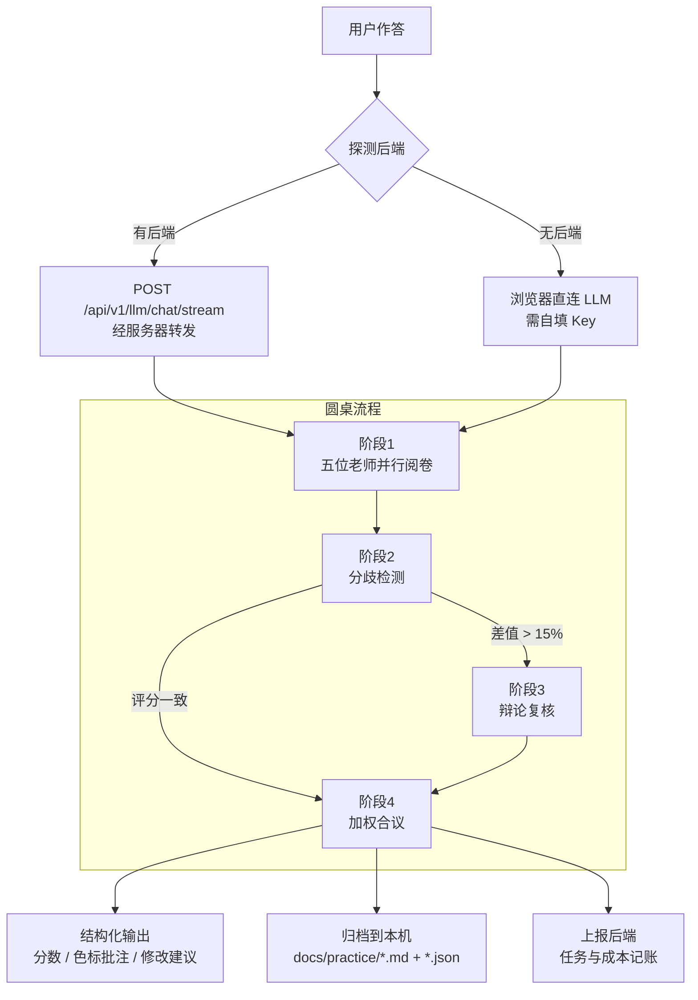

# 蓝笔申论 BluePencil

> 输入一篇作答 → 五位申论名师各按自己的方法论独立阅卷 → 分歧自动复核 → 圆桌合议出一份综合批改


---

## 目录

- [项目简介](#项目简介)
- [核心特性](#核心特性)
- [五位阅卷老师](#五位阅卷老师)
- [技术栈](#技术栈)
- [系统架构](#系统架构)
- [设计风格](#设计风格)
- [快速开始](#快速开始)
- [项目结构](#项目结构)
- [API 一览](#api-一览)
- [三种打包产物](#三种打包产物)
- [做个桌面版发给别人](#做个桌面版发给别人)
- [开发验证工具](#开发验证工具)
- [常见问题](#常见问题)
- [上线部署](#上线部署)
- [作者与开源](#作者与开源)
- [免责声明](#免责声明)

---

## 项目简介

市面上的申论 AI 批改基本都是「一个模型、一条流水线、一个分数」——你写什么它都给你打 70 分，理由说得很像那么回事，但换个模型结论就变了。

蓝笔申论换了个思路：**不模拟一个老师，而是模拟一场阅卷**。

五位申论老师（袁东、周泰然、白鹭、Kiwi、李崇立）各有自己的一套方法论，每人的原始讲义都完整内置在程序里。系统把讲义提炼成**专属批改指令**，让五位老师从不同角度切进去批同一份作答：

- **袁东**盯采分词有没有踩准
- **周泰然**盯要点有没有按材料逻辑拆对
- **白鹭**盯形式有没有回应问法
- **Kiwi**盯分类有没有做到互斥穷尽
- **李崇立**盯表述有没有被自编词替换掉原词

因为是五套不同的评判标准，**分数会真的分歧**——分歧本身就是有价值的信息。三个及以上老师同时阅卷时，系统会检测分歧、触发复核辩论，最后合议出一份综合结论。

---

## 核心特性

**用户自选阅卷组合（1~5 人）**
单人快速批改、双人联合评定、三人以上圆桌合议，适配不同阶段：日常刷题用单人，专项强化用双人，模考复盘用圆桌。

**分歧检测与圆桌辩论**
并行阅卷后自动比对得分率，差值超过 15% 触发二次复核。注意：**不是每次都辩论**——只有真分歧才复核，评分一致时直接进合议，这既省 token 又让辩论结果有信息量。

**加权合议**
按老师的评审侧重分配权重（客观采分派权重最高），融合各方结论，剔除片面评价与极端分数。

**先答题，再批改；每位老师一种颜色**
答题页是沉浸式单栏，答完了才进入批改。结果页把各老师的逐句批注按**各自颜色**标在作答原文上——同一句被多位老师标中时，下划线按人数分段着色，悬停可看全部意见；每位老师另给一段「如果只改一处先改哪里」的修改建议。

**每日一练：进页面就有题有材料**
打开练习页会自动载入当天的题目（题目 + 给定资料 + 作答要求 + 分值 + 字数限制一并到位），不用自己去别处找题再手抄一遍。选题是**确定性**的（按本地日期散列），同一天刷新多少次都是同一道；旁边「换一题」可随机切换，「从题库选题」可搜索挑选。首页也有今日一练入口。

**内置题库与文章库**
31 篇官媒时评（约 9.5 万字，覆盖 9 个主题）开箱即用；题库含 **15 道完整题目，覆盖五种题型**（归纳概括 / 综合分析 / 提出对策 / 贯彻执行 / 大作文），每题都带**完整给定资料与参考答案**，材料按「材料1 / 材料2」分则渲染。支持上传文件 / 选整个文件夹批量导入、JSON 文章包导入导出。

> 题库里的材料是**按真题命题风格自编的仿真材料**（题型、材料结构、数据密度对齐真题），不是官方真题原文——界面会明确标注「仿真」。需要真题原文用「录入题目」自行补充。

**记录归档，随时复盘**
每次批改会落成 `docs/practice/` 下一对文件：`.md` 给人读（VSCode / Typora 直接打开），`.json` 给程序读（复盘页据此还原色标）。**离线也能用**——后端不在时退回浏览器 IndexedDB，两边都有时按 id 合并去重。

**方法论透明可查**
「老师」页可以读每位老师的完整讲义原文，也能看到 AI 实际收到的系统提示——不存在黑盒。

**双运行通道，自动切换**
有后端时请求经服务器转发（跨域消失、Key 可服务端统一配置）；没有后端时退化为浏览器直连。**同一套代码，既能当网站跑，也能打包成一个 HTML 文件发给别人双击即用。**

**本地优先，无账号体系**
作答、笔记、错题存在浏览器 IndexedDB，批改记录归档到本机 `docs/`。后端只记录任务级指标（模式、分数、耗时、token），不做用户体系、不需要注册登录。

**更新日志与仓库入口**
首页顶部放 GitHub / Gitee 仓库入口与当前版本号，「更新日志」页按版本列出每轮改动（新增 / 优化 / 变更 / 修复 / 删除分色标注）。仓库地址与日志数据统一在 `frontend/src/data/site.js`，改地址只改一处。

---

## 五位阅卷老师

| 老师 | 流派 | 评审侧重 | 权重 |
|---|---|---|---|
| 袁东 | 按词给分派 | 采分词：动词 + 事情、原词覆盖、宁滥毋缺 | 1.2 |
| 周泰然 | 材料逻辑派 | 要点处理：抄词不抄句、拆点、贴合材料 | 1.1 |
| 白鹭 | 应题意识派 | 应题形式：形式是否回应问法、前置提炼 | 1.0 |
| Kiwi | 框架体系派 | 分类逻辑：MECE、分类维度、层次清晰 | 1.0 |
| 李崇立 | 实用踩点派 | 表述规范：材料原词优先、多写不扣分 | 0.9 |

> 五位老师的讲义原文存放在 `frontend/src/data/teachers/*.md`，会在「老师」页按需懒加载展示。
> 讲义本身带有使用约定（以 AI 身份回答、不冒名、引述方法时加前缀），程序在组装 Prompt 时如实执行。

---

## 技术栈

**前端**

| 依赖 | 版本 | 用途 |
|---|---|---|
| Vue | 3.5 | `<script setup>` 组合式 API |
| Vue Router | 5.x | **hash 模式**——单文件版用 `file://` 打开也能正常路由 |
| Vite | 8.3 | 开发服务器 + 双产物构建 |
| Tailwind CSS | 3.4 | 工具类（`@tailwind` 三行指令在 `style.css` 顶部） |
| ECharts | 6.1 | 五维雷达图与趋势统计 |
| vite-plugin-singlefile | 2.3 | 单文件产物 |

> 提示/确认框是自己实现的（`utils/toast.js` + `components/ToastHost.vue`，约 120 行）。
> 早先只用到一个 UI 库的 `Message` 和 `Modal` 两个 API，却为此背上 460KB 的 `arco.css`——
> 实测打包后 CSS 的 gzip 体积与 `arco.css` 单独 gzip **只差 77 字节**，等于样式产物全是它。
> 现在换成自实现，CSS 从 405KB 降到 24KB。

**后端**

| 依赖 | 用途 |
|---|---|
| FastAPI + Uvicorn | 异步 Web 框架 |
| SQLAlchemy 2.0 (async) + aiosqlite | 零配置 SQLite，`ENABLE_PERSISTENCE` 可一键关闭 |
| httpx | 直连 OpenAI 协议接口，**不引入 langchain**，依赖更轻 |
| pydantic-settings + loguru | 配置与日志 |

---

## 系统架构



**通道自动切换逻辑**：前端启动时探测 `/api/v1/health`，通则全程走后端；失败则退回直连，并在运行期一旦发现后端不可达就立即降级，不阻塞用户。

**为什么后端只做网关、不做 Prompt 组装？**
Prompt 的唯一来源是前端 `src/agents/`。如果后端再实现一遍，两边必然出现不一致——查问题时不知道该信哪份。所以后端职责收得很窄：**安全转发、并发调度、记账**。

---

## 设计风格

界面走 **Natural Organic（自然有机风）**：暖米底、胡桃棕主色、鼠尾草绿点缀、衬线标题、
大圆角与纸质感。选它不是为了好看——暖色久看不累，纸张意象也贴合「申论 = 纸笔写作」的心理预期。

**所有颜色都走语义 token，不在业务代码里写十六进制。** 定义在 `frontend/tailwind.config.js` 的
`theme.extend.colors.c` 下，前缀 `c-` 避免与 Tailwind 内置的 `stone` / `amber` 冲突：

| token | 值 | 用途 |
|---|---|---|
| `c-cream` | `#faf6f1` | 页面底色 |
| `c-paper` | `#fffdfb` | 纸面（输入框、方格纸） |
| `c-bark` | `#5c4033` | 主色：胡桃棕 |
| `c-barkSoft` | `#f2ebe2` | 主色极浅底（导航选中态） |
| `c-sage` | `#8b9d77` | 鼠尾草绿：成功 / 建议 |
| `c-tan` | `#d4a373` | 暖褐：次强调 |
| `c-clay` | `#b4552d` | 陶土：警示 / 超字数 |
| `c-ink` / `c-body` / `c-muted` | `#1c1917` / `#44403c` / `#78716c` | 标题 / 正文 / 次要文字 |

`style.css` 里那几个 `.neu*` 工具类**名字保留、定义换掉了**——它们现在是「暖米底 + 1px 描边 + 极轻纸感阴影」，
不再是双向阴影。这样做的原因：换肤前全项目有 161 处 `neu-*` 调用点，
保留类名意味着这些调用点自动跟随，不必逐个改类名（否则每处都要改，且极易漏）。

老师色标是**功能性例外**：五位老师需要 5 种可区分的颜色，纯大地色系区分度不够。
所以取「扩展大地色相」——深湖蓝 / 苔绿 / 赤陶红 / 藕紫 / 赭黄，
明度与饱和度都压低以融入暖调，但色相拉开以保证辨识度。

---

## 快速开始

### 环境要求

| 项目 | 版本 | 说明 |
|---|---|---|
| Node.js | 20.19+ / 22+ | Vite 8 要求，前端必需 |
| Python | 3.11+ | 后端可选，不装也能用（走直连）。开发环境用的是 3.13 |
| LLM API Key | — | 任意 OpenAI 协议兼容服务（DeepSeek / 通义 / 智谱 / OpenRouter） |

### 端口约定（重要）

| 服务 | 端口 | 为什么不是默认值 |
|---|---|---|
| 前端 dev server | **5273** | 默认的 5173 常被其他项目占用 |
| 后端 API | **8100** | 默认的 8000 常被 `resumatch-ai` 占用 |

两个项目抢同一个端口时，**后启动的那个会静默 bind 失败**，而前端代理照常工作——于是请求全被打到另一个项目上，症状看起来像「代码 bug」。所以本项目两个端口都选了非默认值，并在 `vite.config.js` 里开了 `strictPort`：端口被占直接报错，而不是静默换号。

### 1. 启动后端（可选，但建议）

```bash
cd backend

# 创建虚拟环境
python -m venv .venv
.venv/Scripts/activate        # Windows
# source .venv/bin/activate   # macOS / Linux

pip install -r requirements.txt
cp .env.example .env          # 按需填 LLM_API_KEY

python run.py                 # 等价于 uvicorn app.main:app --reload --port 8100
```

启动后访问 `http://127.0.0.1:8100/docs` 查看交互式 API 文档。

`run.py` 会在启动前做两项自检，把两种最常见的坑直接说清楚：

1. **解释器选错**——比如在 PyCharm 里用了 Anaconda 的环境，缺 `sqlalchemy` 时会明确告诉你应该切到 `backend/.venv/Scripts/python.exe`
2. **端口被占**——会打印占用进程的 PID 和对应的 `taskkill` 命令；如果占端口的就是本项目后端，则提示「已在运行」并以退出码 0 结束

> 不装后端也能跑——前端会自动退回浏览器直连模式，只是需要在设置页自己填 Key。

### 跑测试

```bash
cd backend && .venv/Scripts/python.exe -m pytest    # 10 passed
```

也可以直接在仓库根跑 `python -m pytest`——`pytest.ini` 放在仓库根就是为了让**任何目录下跑结果都一致**。

> 配置若只放 `backend/pytest.ini`，从仓库根裸跑 `pytest` 时它不会被加载，`asyncio_mode=auto` 丢失，
> 所有异步用例会报 `requested an async fixture ... with no plugin or hook`——看着像代码坏了，其实只是配置没读到。

### 2. 启动前端

```bash
cd frontend
npm install
npm run dev
```

访问 `http://localhost:5273`。Vite 已配置 `/api` 代理到 `127.0.0.1:8100`，无需额外处理跨域。

### 3. 配置模型

打开「设置」页：

- **走服务端通道**（页面顶部显示绿点）：Key 可以留空，由后端 `.env` 统一配置
- **走本地直连**（灰点）：必须填自己的 API 地址、Key、模型名

内置三个服务商预设（DeepSeek / 智谱 GLM / OpenAI），点一下即可填好地址与模型名。Base URL 三种写法都能识别：只填域名、`.../v1`、`.../paas/v4`（智谱）、甚至完整的 `.../chat/completions`。

---

## 项目结构

```
bluepencil/
├── backend/
│   ├── app/
│   │   ├── main.py                 # FastAPI 入口、路由注册、CORS、生命周期、托管前端
│   │   ├── core/
│   │   │   ├── config.py           # pydantic-settings；打包后路径解析、config.json 预置
│   │   │   └── db.py               # 异步引擎、Session、连接池
│   │   ├── models/
│   │   │   ├── entities.py         # GradingTask / LLMCallLog
│   │   │   └── schemas.py          # 出入参模型
│   │   ├── api/v1/
│   │   │   ├── health.py           # 健康检查（前端靠它判断通道）
│   │   │   ├── llm.py              # LLM 网关：单次 / 流式 / 批量并发
│   │   │   ├── grading.py          # 批改任务记录与历史
│   │   │   ├── records.py          # 练习记录归档（读写 docs/practice/）
│   │   │   ├── stats.py            # 成本与用量统计
│   │   │   └── settings.py         # 模型连通性测试 + 服务端托管配置查询
│   │   ├── services/
│   │   │   ├── llm_service.py      # httpx 调用、重试退避、并发限流
│   │   │   ├── grading_service.py  # 落库与统计聚合
│   │   │   └── record_service.py   # 记录渲染：结构化数据 → Markdown
│   │   └── agents/llm.py           # LLM 配置解析、URL 拼接、请求体构造
│   ├── assets/                     # icon.svg（图标源）+ icon.ico（make_icon.py 生成）
│   ├── data/                       # SQLite 数据库（启动自动生成）
│   ├── tests/                      # conftest.py（临时库隔离）+ 19 项用例
│   ├── desktop.py                  # 桌面版入口：选端口 → 起服务 → 开浏览器
│   ├── build_desktop.py            # 一键打包成可分发的桌面版压缩包
│   ├── make_icon.py                # SVG → 多尺寸 ICO（用 Chrome 无头渲染）
│   ├── release_utils.py            # 打包脚本共用的安全清理函数
│   ├── requirements.txt
│   └── run.py                      # 开发用：python run.py（启动前自检）
│
├── frontend/
│   ├── src/
│   │   ├── main.js                 # 挂载 Vue + Router
│   │   ├── App.vue                 # 左侧分组侧边栏 + 通道状态指示
│   │   ├── router/index.js         # 8 条 hash 路由
│   │   ├── style.css               # Tailwind 指令 + 自然有机风 token 与工具类
│   │   ├── api/
│   │   │   ├── llm.js              # 双通道入口：自动选后端或直连
│   │   │   └── backend.js          # 后端探测、任务上报、记录归档读写
│   │   ├── agents/
│   │   │   ├── teachers.js         # 五位老师的角色定义与专属批改指令
│   │   │   ├── skills.js           # Prompt 组装（含深度模式、辩论、合议、批注契约）
│   │   │   └── orchestrator.js     # 圆桌调度：并行阅卷 → 分歧检测 → 辩论 → 合议
│   │   ├── prompts.js              # 追问与范文生成的 Prompt
│   │   ├── bpq/
│   │   │   └── importer.js         # .bpq 私有题库包：解析 / 校验和 / 入库
│   │   ├── data/
│   │   │   ├── author.js               # **作者信息唯一来源**（署名 / 邮箱 / 仓库 / 许可）
│   │   │   ├── builtin-articles.json   # 内置 31 篇时评
│   │   │   ├── builtin-questions.js    # 内置 15 道题（含完整材料与参考答案，标注为仿真）
│   │   │   ├── questions.js            # 题库统一入口：仿真 + 公开真题 + 私有真题
│   │   │   ├── real-exams/             # 公开真题（2010–2021，自动生成，进仓库）
│   │   │   ├── real-exams-private/     # 私有真题（2022 起，自动生成，**已 gitignore**）
│   │   │   ├── real-exams-private-stub/ # 私有卷空实现：别人 clone 后构建走它
│   │   │   ├── daily.js                # 每日一练选题：按本地日期散列，确定性出题
│   │   │   ├── site.js                 # 仓库地址与产品名（转发 author.js）
│   │   │   ├── changelog.js            # 解析仓库根 CHANGELOG.md，供首页与日志页使用
│   │   │   └── teachers/*.md           # 五位老师讲义原文（?raw 懒加载）
│   │   ├── views/                  # 首页/老师/文章库/题库/练习批改/复盘/统计/设置/更新日志
│   │   ├── components/
│   │   │   ├── GroupedSidebar.vue  # 分组侧边栏（移动端折叠为抽屉）
│   │   │   ├── GridPaper.vue       # 方格作答纸：每行 25 字，格宽随容器实测
│   │   │   ├── ScoreRing.vue       # 分数环
│   │   │   ├── ToastHost.vue       # 轻量提示 / 确认框（替代 Arco）
│   │   │   └── AnnotatedAnswer.vue # 按老师颜色给作答原文划批注
│   │   ├── store/db.js             # IndexedDB 封装
│   │   └── utils/
│   │       ├── record.js           # 记录规范化：本地 ∪ 归档，统一成一种形态
│   │       ├── readiness.js        # 批改就绪判定：本机 Key ∪ 服务端托管 Key
│   │       ├── toast.js            # 命令式提示 / 确认（替代 Arco Message/Modal）
│   │       ├── parse.js            # 批改结果解析（三层兜底）
│   │       └── import.js           # 文章导入导出
│   ├── scripts/
│   │   ├── import-articles.mjs         # 从已抓取数据批量生成内置文章库
│   │   ├── export-articles-to-docs.mjs # 把内置文章库镜像成 Markdown，便于查阅和维护
│   │   └── publish-single.mjs          # 发布单文件版到 release/：文件名带版本号 + 清掉旧版本
│   └── vite.config.js              # 双产物构建 + /api 代理（8100）+ strictPort
│
├── docs/
│   ├── articles/                   # 内置文章库的可读 Markdown 镜像（由脚本生成）
│   ├── practice/                   # 练习记录归档（每篇一对 .md + .json，自动生成）
│   ├── 上线部署分析.md              # 上线可行性、成本测算、部署清单
│   └── 开发记录.md                  # 关键决策与踩坑记录
├── .tools/                         # 开发验证脚本（不参与构建）
│   ├── mock-llm.mjs                # 假 LLM：无 Key 也能端到端跑批改
│   ├── e2e-grade.mjs               # 走完「答题→批改→归档」并核对结果
│   ├── probe-practice.mjs          # 练习页断言：自动载题 + 题库带入字段不丢 + 换题
│   ├── probe-gridpaper.mjs         # 方格纸断言：25 字必须正好一行
│   ├── probe-site-links.mjs        # 首页入口与日志页断言：位置正确 + 与 CHANGELOG.md 一致
│   ├── cdp-probe.mjs               # CDP 探针：真实等待 + 读页面文本
│   ├── batch-shots.mjs             # 全路由截图 + 渲染校验
│   ├── shot-full.mjs               # 整页截图（viewport 之外的题目/材料/格纸）
│   └── shot-annotations.mjs        # 放大看色标批注区
├── release/                        # 分发包（只保留最新一版，文件名带版本号）
├── CHANGELOG.md                    # 更新日志（唯一数据源：网页日志页与打包版本号都读它）
├── pytest.ini                      # pytest 配置（放仓库根，保证任意目录下跑结果一致）
├── PLAN.md                         # 开发计划与现状、待办
└── README.md
```

---

## API 一览

启动后完整文档见 `/docs`。

| 方法 | 路径 | 说明 |
|---|---|---|
| GET | `/api/v1/health` | 健康检查（含数据库连通性） |
| POST | `/api/v1/llm/chat` | 单次非流式调用 |
| POST | `/api/v1/llm/chat/stream` | 单次流式调用（SSE） |
| POST | `/api/v1/llm/chat/batch` | 批量并发调用（圆桌并行阅卷用） |
| POST | `/api/v1/grading/tasks` | 上报一次批改任务 |
| GET | `/api/v1/grading/tasks` | 任务列表 |
| GET | `/api/v1/grading/tasks/{task_id}` | 任务详情 |
| DELETE | `/api/v1/grading/tasks/{task_id}` | 删除任务 |
| POST | `/api/v1/records` | 归档一次练习（落 `docs/practice/*.md` + `*.json`） |
| GET | `/api/v1/records` | 归档列表（**只回摘要，不回正文**） |
| GET | `/api/v1/records/{id}` | 单条完整记录 |
| GET | `/api/v1/records/{id}/markdown` | 取回 Markdown 原文 |
| DELETE | `/api/v1/records/{id}` | 删除记录（md 与 json 一并删） |
| GET | `/api/v1/stats` | 用量与成本统计 |
| POST | `/api/v1/settings/test-llm` | 测试模型连通性 |
| GET | `/api/v1/settings/llm-default` | 查询服务端是否已托管 Key（只回布尔值，不回传 Key） |

---

## 三种打包产物

```bash
cd frontend
npm run build          # → dist/         多文件，用于部署网站 / 打包桌面版
npm run build:single   # → dist-single/  单个 HTML，双击即用
npm run release:single # = build:single + 复制进 release/ 并带上版本号
```

| 产物 | 体积 | 要不要装东西 | 要不要填 Key | 适用 |
|---|---|---|---|---|
| `frontend/dist/` | 3.3 MB | 需要服务器 | 可不填（服务端托管） | 上线网站 |
| `蓝笔申论-单文件版-vX.Y.Z.html` | 1.9 MB | 都不要 | **要填** | 浏览器直连，受 CORS 限制 |
| `蓝笔申论-桌面版-vX.Y.Z.zip` | 23 MB（解压 45 MB） | 都不要 | 可不填（服务端托管） | **发给别人，双击即用** |

> 单文件版把所有 JS/CSS/数据内联进一个 `.html`，31 篇文章与五份讲义都在里面，所以体积看起来不小——但它是**一个自包含的文件**，不依赖任何外部资源。没有后端时自动走浏览器直连，需要在设置页填自己的 Key，且接口必须允许跨域。

**发布约定：产物名带版本号，`release/` 只保留最新一版。**

- 版本号统一取自仓库根 `CHANGELOG.md` 最上面那一版；两个发布脚本（`frontend/scripts/publish-single.mjs`、`backend/build_desktop.py`）都按这条规则读，**读不到会直接报错停下**，不会静默打出一个版本号不对的包
- 每次发布顺手清掉同类旧版本（含早期不带版本号的命名），历史版本不堆积
- 改动记录写在同一个 `CHANGELOG.md` 里 —— 网页「更新日志」页直接读它，改文档即改页面

---

## 做个桌面版发给别人

**目标：对方电脑上不装 Python、不装 Node、不装数据库，解压双击就能用。**

```bash
cd backend
.venv/Scripts/python.exe build_desktop.py     # Windows
# .venv/bin/python build_desktop.py           # macOS / Linux（产物需在对应系统上构建）
```

产出 `release/蓝笔申论-桌面版-vX.Y.Z.zip`（约 23 MB；同名解压目录也在 release/ 下，方便本机直接试跑），对方解压后双击 `蓝笔申论.exe`：程序自己起本地服务、自动打开浏览器、关掉黑窗口即退出。

解压目录里还有一份 `使用说明.txt` 和 `config.example.json`，可以直接连同 zip 一起发给对方。

### 为什么别人不用配置

桌面版把**界面和 API 放在同一个进程**里（FastAPI 顺带用 `StaticFiles` 托管前端），所以：

- 没有跨域问题——请求走同源的 `/api/v1`，不碰浏览器直连
- 不用另起前端服务，也不用手动填地址
- 若在 exe 同级放一个 `config.json`，**连 Key 都省了**：

```json
{
  "LLM_API_KEY": "sk-你的Key",
  "LLM_BASE_URL": "https://api.deepseek.com",
  "LLM_MODEL": "deepseek-chat"
}
```

打包的人填好这一项，使用者打开就能批改，一个字都不用配。设置页会显示「服务端已托管，本机无需填写」。
（`config.json` 里只接受全大写键名 + 字符串值；环境变量优先级更高，不会覆盖已有设置。Key 不会回传给前端，只回一个「是否已配置」的布尔值。）

### 技术要点（踩过的坑）

| 问题 | 原因 | 处理 |
|---|---|---|
| 打包后启动即崩 `No module named 'aiosqlite'` | SQLAlchemy 方言里写的是 `__import__("aiosqlite")`，纯字符串导入，PyInstaller 静态分析看不到 | `--hidden-import aiosqlite`（同理还有 `greenlet`、uvicorn 的 loop/protocol 实现） |
| 打包后读不到 `.env` / 写的库重启就没 | `config.py` 用 `__file__` 推算路径，打包后指向临时解包目录 | 检测 `sys.frozen`，改为取 `sys.executable` 所在目录 |
| 用 one-file 还是 one-folder | — | 选 **one-folder**：启动快（不必每次解压到临时目录），被安全软件误报的概率也低得多 |
| 重新打包时报 `PermissionError` / `Device or resource busy` | 上一次的 exe 还在跑，它的工作目录锁住了发布文件夹 | 先关掉 `蓝笔申论.exe` 再打包（脚本会给出这个提示） |
| 打包脚本在临时目录构建 | 直接删旧产物会触发 Windows 的批量删除保护，连带把打包进程一起杀掉 | 在新目录里构建、用**改名**代替删除、收尾时再清理 |

> `backend/build_desktop.py` 里对每个隐藏导入都写了原因。图标由 `backend/make_icon.py` 从 `assets/icon.svg` 生成——用系统自带 Chrome 无头模式渲染 SVG，不引入任何图形库依赖。

---

## 开发验证工具

`.tools/` 下是一组**不参与构建**的验证脚本。它们解决两个具体问题：**没有真 Key 时怎么验证批改链路**，以及**怎么不被无头浏览器的假象骗到**。

```bash
# 1) 起一个假 LLM（返回固定 JSON，不发外部请求）
node .tools/mock-llm.mjs 9731

# 2) 端到端跑一遍「答题 → 批改 → 色标批注 → 归档」，并把结果页截图
node .tools/e2e-grade.mjs

# 3) 全路由截图 + 渲染校验（含「导航被拆成逐字换行」这类布局回归）
node .tools/batch-shots.mjs

# 4) 练习页断言（自动载题、题库带入字段不丢、换题）
node .tools/probe-practice.mjs

# 5) 方格纸对齐断言（25 字必须正好一行）
node .tools/probe-gridpaper.mjs

# 6) 整页截图，看折叠线以下的内容（题目 / 材料 / 方格纸）
node .tools/shot-full.mjs practice full-practice

# 7) 首页仓库入口 / 更新日志页断言（含窄屏横向溢出检查）
node .tools/probe-site-links.mjs
```

| 脚本 | 用途 |
|---|---|
| `mock-llm.mjs` | OpenAI 兼容的假接口。按 system prompt 判断是「老师阅卷 / 圆桌辩论 / 合议」，返回对应结构的 JSON。**真 Key 只影响内容质量，不影响链路正确性**，所以用它就能把整条链路验穿 |
| `e2e-grade.mjs` | CDP 驱动：注入配置 → 填表 → 点「开始批改」→ 真实等待 → 核对结果页元素。用 Vue 的原生 setter 触发 `input`，`v-model` 才会更新 |
| `probe-practice.mjs` | 练习页断言：进页面自动载入题目、从题库带入时 `requirement/maxScore/wordLimit` 不丢、换一题清空旧作答 |
| `probe-gridpaper.mjs` | 方格纸断言：24/25/26/50/51 字分别应占 1/1/2/2/3 行 |
| `probe-site-links.mjs` | 首页三个入口的 `href` 是否指向真实 remote、500px 窄屏是否横向溢出、更新日志页是否渲染全部版本、有无 console 报错（自动滤掉 dev server 的 HMR 噪声） |
| `cdp-probe.mjs` | 真实等待 N 秒后读 `document.body.innerText` |
| `batch-shots.mjs` | 逐条路由截图并检查标志性文案 |
| `shot-full.mjs` | 整页截图（`captureBeyondViewport`）。viewport 截图看不到题目、材料、方格纸，因为它们都在折叠线以下 |
| `shot-annotations.mjs` | 滚到色标批注区放大截图，并统计「几位老师标了同一句」 |

> **为什么不用 `chrome --headless --screenshot --virtual-time-budget`？**
> 它会把虚拟时间冻住，依赖 `IndexedDB` 或网络回调的异步流程可能永远不 resolve——页面停在「正在读取记录…」，
> **看起来完全像一个 bug，实际只是截图方式的假象**。所以涉及本地数据或接口的页面，一律走 CDP 真实等待。

> **CDP 脚本的两个坑**（都踩过，且都会伪装成「成功」）：
> 1. **不要用固定调试端口**。Windows 上 `proc.kill()` 杀不掉 Chrome 的整个进程树，残留实例继续占着端口；
>    下一次运行 `spawn` 的新实例绑不上端口，而连 `/json/list` 会连到**旧实例**——截图"成功"，拍的却是上一页。改用随机端口。
> 2. **`ROUTE = argv[2] || 'practice'` 这种兜底会把首页吃掉**。首页的 route 是空字符串，`'' || 'practice'` 得到 `practice`，
>    于是"截首页"永远截到练习页。用 `argv[2] !== undefined ? argv[2] : 'practice'`。同理适用任何"空字符串是合法值"的参数。

---

## 常见问题

<details>
<summary>启动后端报 <code>[WinError 10013]</code> 或 <code>[WinError 10048]</code></summary>

端口被占了。Windows 对「同一个地址被重复绑定」有时报 10013（访问权限不允许）而不是更常见的 10048（地址已在使用），看起来像权限问题，其实只是端口冲突。

`python run.py` 会自动查出来并把占用进程的 PID 和 `taskkill` 命令打印给你。也可以手动排查：

```bash
netstat -ano | findstr :8100
tasklist /FI "PID eq <上面查到的PID>"
```

</details>

<details>
<summary>PyCharm 里点运行，报 <code>ModuleNotFoundError: No module named 'sqlalchemy'</code></summary>

解释器选错了。常见情况是 PyCharm 用了 Anaconda 之类的环境，而项目依赖装在 `backend/.venv` 里。

改法：**Settings → Project: bluepencil → Python Interpreter → Add Interpreter → Existing**，选 `backend/.venv/Scripts/python.exe`。

`run.py` 会把当前解释器路径和应该用的路径都打印出来。

</details>

<details>
<summary>页面上不显示 API 配置状态，或功能异常，怀疑请求打到了别的项目</summary>

验证一下代理指向：

```bash
curl http://127.0.0.1:5273/api/v1/health
```

返回的 `app` 字段应该是 `蓝笔申论 BluePencil`。如果返回的是别的项目名，说明后端端口被另一个项目占了，或者它根本没起来。

</details>

<details>
<summary>点「测试连接」提示「请求发不出去」</summary>

这是 CORS。浏览器不允许网页直接调用不接受跨域的接口。

两个解法：
1. **启动后端**（推荐）——请求改由服务器转发，跨域问题消失
2. **换中转地址**——把 API 地址换成支持跨域的中转服务，Key 仍填自己的

> 排查技巧：**拿假 Key 打测试连接，看返回的错误类型**。`401 = 地址对`（服务器已应答，只是 Key 假）；`404 = 地址拼错`。

</details>

<details>
<summary>批改用了多少 token / 花了多少钱</summary>

后端跑起来之后访问 `http://127.0.0.1:8100/api/v1/stats`，或在「统计」页查看调用次数、token 总量与估算成本。

**注意成本差异很大**：单师批改约 ¥0.009，五师圆桌 + 深度模式约 ¥0.22——深度模式会把每位老师两三万字的讲义整篇注入，token 涨 15~20 倍。建议先用「三师圆桌」预设 + 关闭深度模式。

</details>

<details>
<summary>后端报 sqlite3 相关错误</summary>

SQLite 文件在 `backend/data/bluepencil.db`，启动时自动创建。如果这个文件被损坏或权限异常，直接删掉重启即可（只影响任务统计，用户数据在前端）。

想彻底不用数据库：`.env` 里设 `ENABLE_PERSISTENCE=False`，后端退回为纯网关。

</details>

<details>
<summary>单文件版怎么用后端</summary>

在「设置 → 高级 → 后端地址」填你部署的服务器地址（填到域名即可），单文件版也会走服务端通道。留空则始终走浏览器直连。

</details>

<details>
<summary>模型返回的不是合法 JSON</summary>

前端 `utils/parse.js` 做了三层兜底：剥离代码块标记 → 取第一个 `{` 到最后一个 `}` 之间的片段 → 括号配平扫描定位完整对象（应对 JSON 后面还跟着解释文字的情况）。仍解析失败时会保留原始输出并提示，不会让整次批改中断。

</details>

---

## 上线部署

见 [`docs/上线部署分析.md`](docs/上线部署分析.md)，涵盖：

- 三种上线形态（静态托管 / 前后端一体 / 容器化）的取舍
- **成本测算表**：各模式的单次批改成本与规模化后的月账单
- 真正的阻塞项：鉴权、限流、配额（以及为什么这三件事必须在公开前做完）
- Nginx 配置（含流式转发必须关缓冲这一条）
- 分阶段路线：本地演示 → 小范围内测 → 半公开 → 正式上线

---

## 作者与开源

**作者 许一** · [xuconghui_03@qq.com](mailto:xuconghui_03@qq.com)

| 入口 | 地址 |
|---|---|
| GitHub | <https://github.com/xuyi19/bluepencli> |
| Gitee | <https://gitee.com/xuyi_19/bluepencil> |
| 开源地址 | <https://github.com/xuyi19/bluepencli> |

两个仓库内容一致，国内访问走 Gitee，海外或提 issue 走 GitHub。作者信息在代码里只有一处来源：
[`frontend/src/data/author.js`](frontend/src/data/author.js) —— 侧边栏、首页页脚、设置页「关于」、
浏览器控制台横幅都从它取；`.tools/add_watermark.py` 负责给核心源文件打作者注释头。

### 公开层与私有层

| 层 | 内容 | 分发方式 |
|---|---|---|
| 公开 | 框架代码 + **2010–2021 年国考真题（24 套 / 119 题）** + 15 道仿真题 | 本仓库，AGPL-3.0 |
| 私有 | **2022 年起的国考真题（9 套 / 45 题）** | 作者定向分发 `.bpq` 题库包，使用者自行导入 |

私有卷**不在本仓库，也不在任何一个分发包里**（源码见 `frontend/src/data/real-exams-private/`，
已 gitignore；构建走 `frontend/src/data/real-exams-private-stub/` 的空实现）。
拿不到私有卷时软件照常可用，只是题库里没有 2022 年起的卷 —— 需要向作者索取题库包，
在「题库 → 导入题库包」里导入。每个包带使用者水印，**请勿二次转发**。

构建时的分层开关（默认不含私有卷，这一条是刻意的）：

```bash
npm run build               # 公开·网站版        → dist/
npm run build:single        # 公开·单文件版      → dist-single/   （发给别人用这个）
npm run build:local         # 本机·网站版（含私有卷）
npm run build:single:local  # 本机·单文件版（含私有卷）
```

---

## 免责声明

- 本项目为个人学习与技术研究成果，**不得用于任何商业用途**。
- 内置的五位老师讲义来源于公开学习资料，版权归原作者所有，此处仅用于个人学习研究。若需公开部署，请自行替换或获取授权。
- AI 给出的评分与建议仅供参考，**不构成任何备考决策依据**，更不能替代真实阅卷。
- 作答内容默认只存在浏览器本地。若自行部署后端并开启持久化，请遵守相关法律法规，做好数据保护。

---

## License

[AGPL-3.0](LICENSE) © 2026 许一 <xuconghui_03@qq.com>

可以自由使用、修改、再分发，但**衍生作品必须以同样的许可证开源，并保留作者署名**。
换句话说：拿这份代码改成自己的东西可以，但改完也得开源、也得写清楚是从这里来的。
