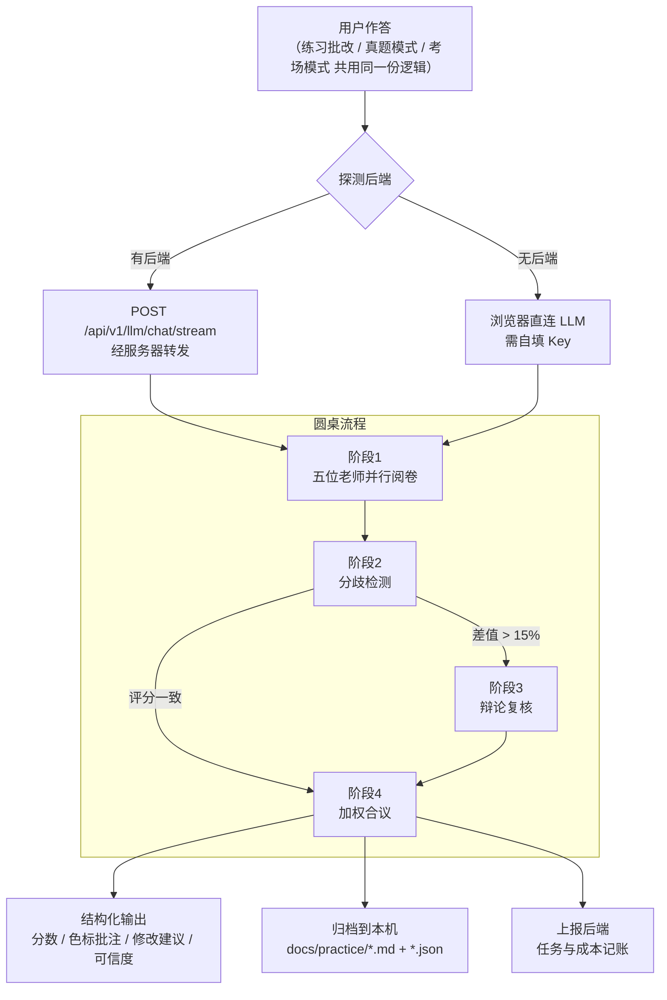

# 蓝笔申论 BluePencil

> 输入一篇作答 → 五位申论名师各按自己的方法论独立阅卷 → 分歧自动复核 → 圆桌合议出一份综合批改


---

## 目录

- [这是什么](#这是什么)
- [核心特性](#核心特性)
- [三种练习形态](#三种练习形态)
- [五位阅卷老师](#五位阅卷老师)
- [评分内核](#评分内核)
- [技术栈](#技术栈)
- [系统架构](#系统架构)
- [设计风格](#设计风格)
- [快速开始](#快速开始)
- [项目结构](#项目结构)
- [API 一览](#api-一览)
- [三种打包产物](#三种打包产物)
- [做个桌面版发给别人](#做个桌面版发给别人)
- [开发验证工具](#开发验证工具)
- [常见问题](#常见问题)
- [上线部署](#上线部署)
- [公开层与私有层](#公开层与私有层)
- [管理员端（作者专用）](#管理员端作者专用)
- [作者与开源](#作者与开源)
- [微信与社区](#微信与社区)
- [免责声明](#免责声明)

---

## 这是什么

市面上的申论 AI 批改基本都是「一个模型、一条流水线、一个分数」——你写什么它都给你打 70 分，理由说得很像那么回事，但换个模型结论就变了。

蓝笔申论换了个思路：**不模拟一个老师，而是模拟一场阅卷**。

五位申论老师（袁东、周泰然、白鹭、Kiwi、李崇立）各有自己的一套方法论，每人的原始讲义都完整内置在程序里。系统把讲义提炼成**专属批改指令**，让五位老师从不同角度切进去批同一份作答。因为是五套不同的评判标准，**分数会真的分歧**——分歧本身就是有价值的信息：三个及以上老师同时阅卷时，系统检测分歧、触发复核辩论，最后合议出一份综合结论。

围绕这场「阅卷」，项目做了三件把 AI 批改从玄学往工程拉的事：

1. **能确定性算出来的绝不交给模型**——采分点标准层 + 纯代码硬规则校验，先给模型锚点，再给客观旁证；
2. **分数必须可追溯**——每次批改存档当时的标准版本、提示词、模型与温度，任何时候能回答「这个分是怎么来的」；
3. **可信度要自己交代**——分数旁一张可信度卡，六个纯代码信号说清这个分有多少依据，没依据就明说「不适用」。

一套前端三种产物：**网站**（FastAPI 网关）、**单文件 HTML**（双击即用）、**桌面版**（Tauri 2，9.6 MB 双击即用免安装）。

---

## 核心特性

### 三种练习形态（训练 / 真题 / 考场）

| 形态 | 入口 | 特点 |
|---|---|---|
| **练习批改（训练）** | 实战 → 练习批改 | 材料按本题引用**裁剪**（省成本、更聚焦）；随时批改、随时看参考答案 |
| **真题模式** | 实战 → 真题模式 | **按原卷给全材料**，练「在整卷里找资料」——材料更全，批改成本也更高（可一键切回本题材料） |
| **考场模式** | 实战 → 考场模式 | 落笔即倒计时（大作文默认 60 分钟、贯彻执行 40、其他 30，**可调至 120**），最后 5 分钟变红，交卷两段确认，**时间到自动交卷**；作答用时记入报告 |

三种形态**共用同一份作答与批改逻辑**——差异只落在材料口径与约束上，不是三份实现，行为不会漂移。

**荧光标注：读材料时把重点圈出来**
材料区直接划选文字即弹色板，五种荧光色（黄/绿/蓝/粉/紫）标关键词、关键句；作答区一键切入「标注态」同样可划（编辑态与标注态分离，textarea 的原生输入体验一点不动）。标记存本机、按题目维度，**同一道题下次打开还在**。结果页里你的荧光与老师的色标批注**叠加显示**：背景色＝你划的重点，下划线＝老师的批注，一眼分得清「我划了什么」和「老师指了什么」。

**用户自选阅卷组合（1~5 人）**
单人快速批改、双人联合评定、三人以上圆桌合议，适配不同阶段：日常刷题用单人，专项强化用双人，模考复盘用圆桌。

**分歧检测与圆桌辩论**
并行阅卷后自动比对得分率，差值超过 15% 触发二次复核。**不是每次都辩论**——只有真分歧才复核，评分一致时直接进合议，既省 token 又让辩论结果有信息量。

**加权合议**
按老师的评审侧重分配权重（客观采分派权重最高），融合各方结论，剔除片面评价与极端分数。

**分数不是黑盒：采分点锚点 + 客观校验**
每道题可预置一份**采分点标准**（分值、材料原文依据、判据关键词，支持**同义表述**与**反向要点**——该有的词没写不给分，写了解释性套话也不给分），批改时同时注入五位老师——老师有了共同锚点，分数才可比、可复算。之外还有一层**纯代码的硬规则校验**（字数、标点格式、结构分条、重复与照抄），不交给模型「感觉」；客观扣分封顶满分 20%，只作旁证、不改写 AI 分。练习页因此多两块面板——「客观校验」列出问题与改法，「采分点对照」给出覆盖率与逐点命中情况。**没有录标准的题照旧能批改**，只是少了这层锚点。

**批改结果可追溯（结果冻结）**
每次批改把**当时用的标准、提示词、模型、温度**一并存档。题库以后改了标准、换了模型，历史记录里的分数依然能回答「当时是按什么判的」——评分口径是流动的，追溯不能断。

**评分可信度卡：让分数自己交代依据**
分数旁边六个纯代码信号：老师一致性、与程序粗判的吻合度、标准来源、阅卷完成度、客观校验、分歧复核。两条铁律：**没依据必须显示「不适用」**（单人批改不许谎称"分歧 0%"），**每个数字必须带算法口径**。它只做旁证，不改写 AI 分数；天花板 96 分，再好也不给满分。

**每日一练：进页面就有题有材料**
打开练习页自动载入当天的题目（确定性选题，按本地日期散列，同一天刷新多少次都是同一道）；「换一题」随机切，「从题库选题」可搜索、可按题型/体系/年份筛选。

**内置题库与文章库**
**53 套 / 239 题**：2010–2021 国考真题 24 套 119 题、2008–2021 河北省考真题 16 套 62 题、15 道仿真题（公开层），2022 年起真题以加密题库包定向分发（私有层）。每题带完整给定资料与参考答案，材料按「材料1 / 材料2」分则渲染。31 篇官媒时评（约 9.5 万字）开箱即用。支持拖拽 / 选文件夹批量导入、JSON 文章包导入导出。

**记录归档，随时复盘**
每次批改落成 `docs/practice/` 下一对文件：`.md` 给人读，`.json` 给程序读（复盘页据此还原色标）。**离线也能用**——后端不在时退回浏览器 IndexedDB，两边都有时按 id 合并去重。跑桌面版时这个目录在 **exe 同级**，复制一份 exe 就等于带着自己的记录走。

**能力画像与错题本**
固定六维（要点覆盖/材料运用/结构条理/审题应题/语言表达/规范体例）由错误类型反推画像，样本不足不画、未评不进轴、每维带依据；错误类型统一 12 类口径，跨记录聚合出错题本与针对性推荐。

**双运行通道，自动切换**
有后端时请求经服务器转发（跨域消失、Key 服务端统一配置）；没有后端时退化为浏览器直连。同一套代码，既能当网站跑，也能打包成一个 HTML 文件发给别人双击即用。

**本地优先，无账号体系**
作答、笔记、错题存在浏览器 IndexedDB，批改记录归档到本机 `docs/`。后端只记录任务级指标（模式、分数、耗时、token），不做用户体系。

---

## 五位阅卷老师

| 老师 | 流派 | 评审侧重 | 权重 |
|---|---|---|---|
| 袁东 | 按词给分派 | 采分词：动词 + 事情、原词覆盖、宁滥毋缺 | 1.2 |
| 周泰然 | 材料逻辑派 | 要点处理：抄词不抄句、拆点、贴合材料 | 1.1 |
| 白鹭 | 应题意识派 | 应题形式：形式是否回应问法、前置提炼 | 1.0 |
| Kiwi | 框架体系派 | 分类逻辑：MECE、分类维度、层次清晰 | 1.0 |
| 李崇立 | 实用踩点派 | 表述规范：材料原词优先、多写不扣分 | 0.9 |

> 五位老师的讲义原文存放在 `frontend/src/data/teachers/*.md`，会在「老师」页按需懒加载展示。
> 「老师」页也能看到 AI 实际收到的系统提示——不存在黑盒。

---

## 评分内核

AI 批改最容易失去可信度的地方是：**换个模型分数就变了，谁也说不清为什么**。
这里的做法是把「评分」拆成五层，**能确定性算出来的就绝不交给模型**：

| 层 | 由谁负责 | 产出 | 状态 |
|---|---|---|---|
| ① 题目标准层 | 人工 / 预解析，**固定复用** | 采分点（分值 · 材料原文依据 · 判据关键词 · 同义表述 · 反向要点） | 已完成 |
| ② 模型阅卷层 | 五位老师各自独立 | 分数 + 逐句批注 + 修改建议 | 已完成 |
| ③ 纯代码校验层 | `utils/grading/rules.js`，零依赖 | 字数 / 格式 / 结构 / 重复照抄的客观结论 | 已完成 |
| ④ 合议层 | 分歧检测 → 辩论 → 加权合议 | 综合分数与结论 | 已完成 |
| ⑤ 训练层 | 错误类型 → 能力画像 → 推荐下一题 | 六维画像与弱项推荐（已部分落地） | 迭代中 |

**① 采分点标准层**（`agents/grading/standard.js` + `standardResolver.js`）
给题目预先备一份采分点标准，批改时注入每位老师的提示词。老师有了**共同锚点**，评分才可比、可复算。
标准可以批量预解析（`.tools/standards/gen_standards.mjs`，`--mock` 无 Key 也能跑通链路），
也可以人工精校——校准工具 `node .tools/standards/calibrate.mjs --draft <题目id>` 出草稿、`--wizard` 交互式录入。
**有标准更好，没有标准照旧裸判**，不会因为一道题没录标准就罢工。

**③ 纯代码校验层**（`utils/grading/rules.js`）
字数、标点格式、结构分条、重复与照抄四类校验，纯代码、可复算。客观扣分默认**封顶为满分的 20%**，
且**只作旁证、不直接改写 AI 分数**——规则负责指出「板上钉钉」的问题，改不改由合议层判断。

**数据分层**：公开卷与仿真题的标准在 `data/standards/`（进仓库）；
私有卷的标准在 `data/standards-private/`（**已 gitignore**，走 `@private-standards` 别名）——
**写出采分点等于泄题**，必须和私有卷正文一起隔离。

**可信度与追溯**：分数旁的可信度卡（`utils/grading/credibility.js`，34 项单测盯口径）与结果冻结
（每次批改存档标准版本 / 提示词 / 模型）见「核心特性」。两条不能破的规矩：
**没依据必须显示「不适用」**，**每个数字必须带算法口径**。

**成本控制**：真题的 `material` 存整卷，而一道小题通常只问其中一两则——
`materialTrim` 按题目引用自动裁材料（实测材料省 79%、单次 prompt 省 52%），
真题模式下想看整卷一键切回。解析不出资料号不裁、大作文不裁、引用的号找不到不裁。
真实成本另有 `report-cost.py`（花多少）+ `prompt-size.mjs`（花在哪）两个实测工具。

**校准方式**：评分逻辑不靠「读代码觉得对」，而是靠两端夹住——
后端 pytest 冒烟 + `.tools/` 下 20 余组纯代码单测（改规则、标准、可信度后必跑对应组），
加上若干探针做渲染与端到端验证（见[开发验证工具](#开发验证工具)）。

---

## 技术栈

**前端**

| 依赖 | 版本 | 用途 |
|---|---|---|
| Vue | 3.5 | `<script setup>` 组合式 API |
| Vue Router | 5.x | **hash 模式**——单文件版用 `file://` 打开也能正常路由 |
| Vite | 8.3 | 开发服务器 + 双产物构建 |
| Tailwind CSS | 3.4 | 工具类（语义 token，见[设计风格](#设计风格)） |
| ECharts | 6.1 | 六维雷达图与趋势统计 |
| vite-plugin-singlefile | 2.3 | 单文件产物 |

> 提示/确认框是自己实现的（`utils/toast.js` + `components/ToastHost.vue`，约 120 行）。
> 早先只用到一个 UI 库的 `Message` 和 `Modal` 两个 API，却为此背上 460KB 的 `arco.css`——
> 现在换成自实现，CSS 从 405KB 降到 24KB。

**后端**

| 依赖 | 用途 |
|---|---|
| FastAPI + Uvicorn | 异步 Web 框架 |
| SQLAlchemy 2.0 (async) + aiosqlite | 零配置 SQLite，`ENABLE_PERSISTENCE` 可一键关闭 |
| httpx | 直连 OpenAI 协议接口，**不引入 langchain**，依赖更轻 |
| pydantic-settings + loguru | 配置与日志 |

**桌面版**

| 依赖 | 用途 |
|---|---|
| Tauri 2 + Rust | 9.6 MB 单文件 exe，内嵌前端 + 本地网关，关窗即退 |
| tauri-plugin-single-instance | 单实例锁：重复双击唤起已有窗口，而不是起第二个抢端口 |

---

## 系统架构



**通道自动切换逻辑**：前端启动时探测 `/api/v1/health`，通则全程走后端；失败则退回直连，并在运行期一旦发现后端不可达就立即降级，不阻塞用户。

**为什么后端只做网关、不做 Prompt 组装？**
Prompt 的唯一来源是前端 `src/agents/`。如果后端再实现一遍，两边必然出现不一致——查问题时不知道该信哪份。所以后端职责收得很窄：**安全转发、并发调度、记账**。

---

## 设计风格

界面走 **Natural Organic（自然有机风）**：暖米底、胡桃棕主色、鼠尾草绿点缀、衬线标题、
大圆角与纸质感。选它不是为了好看——暖色久看不累，纸张意象也贴合「申论 = 纸笔写作」的心理预期。

**所有颜色都走语义 token，不在业务代码里写十六进制。** 定义在 `frontend/tailwind.config.js` 的
`theme.extend.colors.c` 下，前缀 `c-` 避免与 Tailwind 内置的 `stone` / `amber` 冲突：

| token | 值 | 用途 |
|---|---|---|
| `c-cream` | `#faf6f1` | 页面底色 |
| `c-paper` | `#fffdfb` | 纸面（输入框、方格纸） |
| `c-bark` | `#5c4033` | 主色：胡桃棕 |
| `c-barkSoft` | `#f2ebe2` | 主色极浅底（导航选中态） |
| `c-sage` | `#8b9d77` | 鼠尾草绿：成功 / 建议 |
| `c-tan` | `#d4a373` | 暖褐：次强调 |
| `c-clay` | `#b4552d` | 陶土：警示 / 超字数 |
| `c-ink` / `c-body` / `c-muted` | `#1c1917` / `#44403c` / `#78716c` | 标题 / 正文 / 次要文字 |

`style.css` 里那几个 `.neu*` 工具类**名字保留、定义换掉了**——它们现在是「暖米底 + 1px 描边 + 极轻纸感阴影」，
不再是双向阴影。这样做的原因：换肤前全项目有 161 处 `neu-*` 调用点，
保留类名意味着这些调用点自动跟随，不必逐个改类名。

**两个功能性配色例外**：五位老师需要 5 种可区分的批注色，纯大地色系区分度不够，
取「扩展大地色相」——深湖蓝 / 苔绿 / 赤陶红 / 藕紫 / 赭黄，明度压低融入暖调、色相拉开保证辨识；
荧光标注另有一套 5 色半透明色板（黄/绿/蓝/粉/紫），专门设计成「压在正文下、字仍可读」。

---

## 快速开始

### 环境要求

| 项目 | 版本 | 说明 |
|---|---|---|
| Node.js | 20.19+ / 22+ | Vite 8 要求，前端必需 |
| Python | 3.11+ | 后端可选，不装也能用（走直连）。开发环境用的是 3.13 |
| LLM API Key | — | 任意 OpenAI 协议兼容服务（DeepSeek / 通义 / 智谱 / OpenRouter） |

### 端口约定（重要）

| 服务 | 端口 | 为什么不是默认值 |
|---|---|---|
| 前端 dev server | **5273** | 默认的 5173 常被其他项目占用 |
| 后端 API | **8100** | 默认的 8000 常被 `resumatch-ai` 占用 |

两个项目抢同一个端口时，**后启动的那个会静默 bind 失败**，而前端代理照常工作——于是请求全被打到另一个项目上，症状看起来像「代码 bug」。所以本项目两个端口都选了非默认值，并在 `vite.config.js` 里开了 `strictPort`：端口被占直接报错，而不是静默换号。

### 1. 启动后端（可选，但建议）

```bash
cd backend

# 创建虚拟环境
python -m venv .venv
.venv/Scripts/activate        # Windows
# source .venv/bin/activate   # macOS / Linux

pip install -r requirements.txt
cp .env.example .env          # 按需填 LLM_API_KEY

python run.py                 # 等价于 uvicorn app.main:app --reload --port 8100
```

启动后访问 `http://127.0.0.1:8100/docs` 查看交互式 API 文档。

`run.py` 会在启动前做两项自检，把两种最常见的坑直接说清楚：

1. **解释器选错**——比如在 PyCharm 里用了 Anaconda 的环境，缺 `sqlalchemy` 时会明确告诉你应该切到 `backend/.venv/Scripts/python.exe`
2. **端口被占**——会打印占用进程的 PID 和对应的 `taskkill` 命令；如果占端口的就是本项目后端，则提示「已在运行」并以退出码 0 结束

> 不装后端也能跑——前端会自动退回浏览器直连模式，只是需要在设置页自己填 Key。

### 跑测试

```bash
cd backend && .venv/Scripts/python.exe -m pytest
node .tools/test-all.mjs      # 前端 + 纯代码单测 + pytest 一键全量回归（22 套）
```

`pytest.ini` 放在仓库根——**任何目录下跑结果都一致**。

### 2. 启动前端

```bash
cd frontend
npm install
npm run dev
```

访问 `http://localhost:5273`。Vite 已配置 `/api` 代理到 `127.0.0.1:8100`，无需额外处理跨域。

### 3. 配置模型

打开「设置」页：

- **走服务端通道**（页面顶部显示绿点）：Key 可以留空，由后端 `.env` 统一配置
- **走本地直连**（灰点）：必须填自己的 API 地址、Key、模型名

内置三个服务商预设（DeepSeek / 智谱 GLM / OpenAI），点一下即可填好地址与模型名。Base URL 三种写法都能识别：只填域名、`.../v1`、`.../paas/v4`（智谱）、甚至完整的 `.../chat/completions`。

---

## 项目结构

```
bluepencil/
├── backend/                        # FastAPI 网关（转发 / 并发 / 记账，不做 Prompt）
│   ├── app/
│   │   ├── main.py                 # 入口、路由、CORS、生命周期、托管前端
│   │   ├── core/config.py          # pydantic-settings；打包后路径解析
│   │   ├── core/db.py              # 异步引擎、Session、连接池
│   │   ├── models/                 # GradingTask / LLMCallLog + schemas
│   │   ├── api/v1/                 # health / llm / grading / records / stats / settings
│   │   └── services/               # llm_service（重试退避限流）/ record_service（md 渲染）
│   ├── tests/                      # pytest（conftest 临时库隔离）
│   └── run.py                      # 启动前自检：解释器 / 端口
│
├── frontend/                       # Vue 3 + Vite，一套代码三种产物
│   ├── src/
│   │   ├── api/llm.js              # 双通道入口：自动选后端或直连
│   │   ├── agents/                 # **Prompt 唯一来源**
│   │   │   ├── teachers.js         # 五位老师的角色定义与专属批改指令
│   │   │   ├── skills.js           # Prompt 组装（深度模式、辩论、合议、批注契约）
│   │   │   ├── grading/            # 采分点标准层 + 解析器
│   │   │   └── orchestrator.js     # 圆桌调度：并行阅卷 → 分歧 → 辩论 → 合议
│   │   ├── utils/
│   │   │   ├── highlight.js        # 荧光标记纯函数层（文本片段+出现序号锚点）
│   │   │   ├── grading/rules.js    # 硬规则校验（零依赖，纯代码）
│   │   │   ├── grading/credibility.js # 可信度六信号
│   │   │   ├── grading/reviewCard.js  # 复盘卡 + 短板统计
│   │   │   └── fileDrop.js         # 整页拖拽接收 .bpq
│   │   ├── components/
│   │   │   ├── GridPaper.vue       # 方格作答纸：每行 25 字
│   │   │   ├── Highlightable.vue   # 荧光标注（选区→色板→标记，材料/作答共用）
│   │   │   ├── AnnotatedAnswer.vue # 老师色标批注 + 我的荧光叠加渲染
│   │   │   └── ToastHost.vue       # 轻量提示 / 确认框（替代 Arco）
│   │   ├── data/
│   │   │   ├── questions.js        # 题库统一入口：仿真 + 公开真题 + 私有真题
│   │   │   ├── real-exams/         # 公开真题（≤2021，进仓库）
│   │   │   ├── real-exams-private/ # 私有真题（2022 起，**已 gitignore**）
│   │   │   ├── standards/          # 采分点标准（公开部分进仓库）
│   │   │   ├── daily.js            # 每日一练：按本地日期散列，确定性出题
│   │   │   ├── author.js / wechat.js # 作者信息 / 微信二维码（各自唯一来源）
│   │   │   └── changelog-parse.js  # CHANGELOG 解析器（网页日志页直接吃仓库根 md）
│   │   └── views/                  # 首页/老师/文章库/题库/练习批改/真题模式/考场模式/复盘/统计/设置/更新日志
│   └── scripts/                    # build:single / publish-single
│
├── desktop/                        # Tauri 2 桌面版（内嵌前端 + Rust 本地网关）
│   ├── src-tauri/                  # Rust：单实例锁、本地 8100 网关、md 渲染（与 Python 版逐字一致）
│   └── scripts/publish.mjs         # 探针 18 项 → 归置产物（版本号从 CHANGELOG 读，读不到就停）
│
├── admin/                          # 管理员端（作者专用，永不进分发产物）
│   ├── ui/                         # 静态页（题库台账 / 封包 / 发放）
│   └── src-tauri/                  # 独立小应用：spawn node 脚本，口令走 env 不进 argv
│
├── .tools/                         # 验证脚本（不参与构建），见下节
├── docs/                           # 使用说明书 / 项目文档 / 上线部署分析
├── release/                        # 产物（按通道分目录：桌面版 / 单文件版 + 各自历史版本/）
├── 私有题库/                        # .bpq 源包（gitignore 显式忽略）
└── CHANGELOG.md                    # **版本号唯一真源**（网页日志页直接读它）
```

---

## API 一览

启动后完整文档见 `/docs`。

| 方法 | 路径 | 说明 |
|---|---|---|
| GET | `/api/v1/health` | 健康检查（含数据库连通性） |
| POST | `/api/v1/llm/chat` | 单次非流式调用 |
| POST | `/api/v1/llm/chat/stream` | 单次流式调用（SSE） |
| POST | `/api/v1/llm/chat/batch` | 批量并发调用（圆桌并行阅卷用） |
| POST | `/api/v1/grading/tasks` | 上报一次批改任务 |
| GET | `/api/v1/grading/tasks` | 任务列表 |
| GET | `/api/v1/grading/tasks/{task_id}` | 任务详情 |
| DELETE | `/api/v1/grading/tasks/{task_id}` | 删除任务 |
| POST | `/api/v1/records` | 归档一次练习（落 `docs/practice/*.md` + `*.json`） |
| GET | `/api/v1/records` | 归档列表（**只回摘要，不回正文**） |
| GET | `/api/v1/records/{id}` | 单条完整记录 |
| GET | `/api/v1/records/{id}/markdown` | 取回 Markdown 原文 |
| DELETE | `/api/v1/records/{id}` | 删除记录（md 与 json 一并删） |
| GET | `/api/v1/stats` | 用量与成本统计 |
| POST | `/api/v1/settings/test-llm` | 测试模型连通性 |
| GET | `/api/v1/settings/llm-default` | 查询服务端是否已托管 Key（只回布尔值，不回传 Key） |

---

## 三种打包产物

```bash
cd frontend
npm run build          # → dist/         多文件，用于部署网站
npm run build:single   # → dist-single/  单个 HTML，双击即用
npm run release:single # = build:single + 复制进 release/单文件版/ 并带上版本号

cd ../desktop
npm run build          # → 单文件 exe，内嵌前端（前端不必先单独 build，hook 会代跑）
npm run publish        # 探针 18 项验产物后复制进 release/桌面版/，文件名带版本号
```

| 产物 | 体积 | 要不要装东西 | 要不要填 Key | 适用 |
|---|---|---|---|---|
| `frontend/dist/` | 3.3 MB | 需要服务器 | 可不填（服务端托管） | 上线网站 |
| `蓝笔申论-单文件版-vX.Y.Z.html` | 3.0 MB | 都不要 | **要填** | 浏览器直连，受 CORS 限制 |
| `蓝笔申论-桌面版-vX.Y.Z.exe` | 9.6 MB | 都不要 | 可不填（服务端托管） | **发给别人，双击即用** |

> 单文件版把所有 JS/CSS/数据内联进一个 `.html`，31 篇文章、五份讲义、微信二维码图片全在里面。
> 没有后端时自动走浏览器直连，需要在设置页填自己的 Key，且接口必须允许跨域。

**发布约定：产物名带版本号；每个通道目录的根只放最新一版，往期进该通道自己的 `历史版本/`。**

- 版本号统一取自仓库根 `CHANGELOG.md` 最上面那一版（**唯一真源**，与 `tauri.conf.json` / `Cargo.toml` 三处同步）；发布脚本读不到会直接报错停下，不会静默打出一个版本号不对的包
- **分层是为了不挑错包**：早先多个版本的包平铺在一起，文件名只差一处版本号，随手解压一个就是旧版（真发生过）。归档统一走 `node .tools/archive-release.mjs`
- **产物自证版本**：构建时把 `app-version` / `app-build-time` 写进 `index.html` 的 meta；桌面版另附 `版本信息.txt`。不靠文件名猜——文件名可以被随手改
- `.tools/check_release_private.py`：递归破开全部归档产物，报「exam chunk 数 / 是否含私有卷 / 功能指纹」，**发之前跑一遍**
- 改动记录写在同一个 `CHANGELOG.md` 里——网页「更新日志」页直接读它，改文档即改页面

---

## 做个桌面版发给别人

Tauri 2 把体积从 Electron 时代的 45 MB 量级压到 **9.6 MB**：用系统 WebView2 渲染（不打 Chromium），
Rust 侧只做三件事——**单实例锁**（重复双击唤起已有窗口，而不是起第二个进程抢 8100 端口）、
**本地网关**（把 `/api` 转发到 LLM 上游，Key 不落前端）、**md 渲染**（记录的 Markdown 渲染与 Python 版逐字一致，
有 `test-md-parity.mjs` 逐字符 diff 钉着）。关掉窗口就退出，没有常驻进程。

**为什么别人不用配置**：前端打进 exe，网关在本地起，数据库在 exe 同级 `data/`——
解压即用，卸载就是删一个文件。记录、错题、统计全在本地，换电脑复制 exe 同级目录即可迁移。

**发版流程**（本机）：

```bash
cd desktop && npm run publish   # 前端 build → cargo 打包 → 18 项探针 → 归置 release/桌面版/
node .tools/archive-release.mjs # 上一版挪进 历史版本/
backend/.venv/Scripts/python.exe .tools/check_release_private.py   # 私有资产检查
node .tools/test-all.mjs        # 全量回归 22 套
```

> ⚠️ **自己开着桌面版时，publish / 探针会被单实例锁挡住**（测试 exe 秒退）——先关掉正在跑的蓝笔申论。

---

## 开发验证工具

`.tools/` 下是一组**不参与构建**的验证脚本。核心立场：**没有真 Key 也要能验证批改链路**，以及**不被无头浏览器的假象骗到**。

```bash
node .tools/test-all.mjs       # 一键全量回归（自动收集全部 test-*.mjs + pytest，22 套）——发版前必跑

# ── 评分内核纯代码单测（毫秒级，改对应层后必跑）──
node .tools/test-rules.mjs          # 硬规则引擎：24 组
node .tools/test-standards.mjs      # 采分点标准层：25 组
node .tools/test-credibility.mjs    # 可信度口径：34 项（守的是"不许说假话"）
node .tools/test-key-points.mjs     # 采分点归并：34 项（权重合计 = 标准满分）
node .tools/test-review-card.mjs    # 错误类型归一 + 复盘卡：50 项
node .tools/test-highlight.mjs      # 荧光标记锚点：切片完整性 / 重叠先到先得 / 失效不静默丢
node .tools/test-score-clamp.mjs    # 分数钳制（LLM 输出永不直接采信）
node .tools/test-changelog.mjs      # CHANGELOG 解析（改完必跑）
node .tools/test-md-parity.mjs      # md 渲染两份实现逐字比对（改渲染后必跑）
node .tools/test-bpq-crypto.mjs     # 题库包加解密与签名：20 项

# ── 探针（真浏览器 / 真产物）──
node .tools/e2e-grade.mjs           # 假 LLM 端到端：答题 → 批改 → 色标批注 → 归档
node .tools/probe-practice.mjs      # 练习页断言（自动载题、带入字段不丢、换题清空）
node .tools/probe-highlight-ui.mjs  # 荧光标注 UI：真实选区 → 色板 → 落标记 → localStorage（需 dev server）
node .tools/test-exam-entry.mjs     # 三种形态入口与材料口径护栏（21 项）
node .tools/probe-tauri-render.mjs  # 桌面版 18 项（验的是打包产物，不是源码）
node .tools/probe-tauri-data.mjs    # 桌面版数据通道（真落盘、真读回、删完真消失）
node .tools/probe-tauri-grade.mjs   # 桌面版点一次真批改（假 LLM）
node .tools/probe-nav-click.mjs     # 侧边栏入口坐标命中（能渲染 ≠ 点得到）
node .tools/probe-pack-drop.mjs     # 拖拽导入：12 项（真 Chrome 合成原生拖拽事件）

# ── 成本实测 ──
backend/.venv/Scripts/python.exe .tools/report-cost.py   # 真实批改花多少钱（读 llm_call_logs 逐次明细）
node .tools/prompt-size.mjs                             # 单次 prompt 花在哪
```

> **为什么评分内核要有纯代码单测？**
> 批改链路依赖模型，很难一次跑一次断言；但评分里能确定性计算的部分（字数、格式、覆盖率加权）不该依赖模型。
> 把它们抽成纯函数后就能像普通代码一样写断言——改规则先跑单测，比"再批一次看看分数对不对"可靠得多。

> **探针的三个教训**（都踩过，且都会伪装成「成功」）：
> 1. **不要用固定调试端口**——杀不掉 Chrome 进程树时，新实例连上的是旧实例，截图"成功"拍的却是上一页；
> 2. **参数兜底 `argv[2] || 'practice'` 会把空字符串合法值吃掉**——"截首页"永远截到练习页；
> 3. **探针注入的数据要收尾清理**，不污染用户的真实记录。

---

## 常见问题

<details>
<summary>桌面版升级后，双击新 exe，打开的却是旧界面</summary>

WebView2 会复用已打开的标签页。页面入口有**版本自检**：读后端版本，发现页面落后就自动刷新（只刷一次，防无限闪烁）。若仍遇到，关掉所有蓝笔申论窗口再开。
</details>

<details>
<summary>启动后端报 <code>[WinError 10013]</code> 或 <code>[WinError 10048]</code></summary>

8100 端口被占。`run.py` 会打印占用进程的 PID 与 `taskkill` 命令；如果占端口的就是本项目的另一个后端实例，会提示「已在运行」并以退出码 0 结束。
</details>

<details>
<summary>页面上不显示 API 配置状态，或功能异常，怀疑请求打到了别的项目</summary>

两个项目抢端口、后启动的静默 bind 失败时会出现这种「代码 bug」假象。本项目约定 5273 / 8100 非默认端口 + `strictPort`，端口被占直接报错。检查是不是有别的项目占了这两个端口。
</details>

<details>
<summary>批改用了多少 token / 花了多少钱</summary>

统计页看汇总（数据源是后端 `llm_call_logs` 逐次明细）；`.tools/report-cost.py` 出明细报告，`.tools/prompt-size.mjs` 看单次 prompt 的构成。
</details>

<details>
<summary>单文件版怎么用后端</summary>

单文件版默认浏览器直连（填自己的 Key）。接口允许跨域时也可把 API 地址填到后端网关；同源部署直接用网站版 `dist/` 更合适。
</details>

<details>
<summary>模型返回的不是合法 JSON</summary>

批改链路对模型输出有结构契约与容错解析；解析失败的老师会被标记「阅卷未完成」并如实计入可信度卡，不会拿半个结果凑数。
</details>

---

## 上线部署

**第一次用？看[使用说明书](docs/项目文档/使用说明书.md)**——面向使用者：三种打开方式、批改流程、老师圆桌机制、三种练习形态、荧光标注、报告怎么读、数据与隐私。

**想知道项目做到哪了？看[项目现状与规划](docs/项目文档/项目现状与规划.md)**——现在能实现的功能、已完成（含实现说明）、还没完成（含原因）、后续优化方向，一页看清。

**开发规划**：[后续开发规划](docs/项目文档/后续开发规划.md)（三阶段，带工作量与价值排序）；方案对账见 `docs/项目文档/方案*.md` 系列。

部署方案（三种上线形态取舍、成本测算、鉴权限流配额、Nginx 流式转发配置、分阶段路线）
见 [`docs/项目文档/上线部署分析.md`](docs/项目文档/上线部署分析.md)。

---

## 公开层与私有层

| 层 | 内容 | 分发方式 |
|---|---|---|
| 公开 | 框架代码 + **2010–2021 国考真题（24 套 / 119 题）** + **2008–2021 河北省考真题（16 套 / 62 题）** + 15 道仿真题 | 本仓库，AGPL-3.0 |
| 私有 | **2022 年起国考真题（9 套 / 45 题）与河北省考真题（4 套 / 13 题）** | 作者定向分发 `.bpq` 题库包，使用者自行导入 |

合计 **53 套 / 239 题**。**不包含**：私有题库、采分点评分标准、`.bpq` 打包与签名工具——这三样属于核心资产，保留所有权利。

私有卷**不在本仓库，也不在任何一个分发包里**（源码已 gitignore；构建走空实现 stub）。
拿不到私有卷时软件照常可用，只是题库里没有 2022 年起的卷——需要向作者索取题库包，
把 `.bpq` 文件**拖进题库页任意位置**即可导入。加密包会再问一次口令。每个包带使用者水印，**请勿二次转发**。

### 题库包是怎么保护的

`.bpq` 两代格式并存，导入时按 `magic` 自动分辨：

| | v1（`BPQ00001`） | v2（`BPQ00002`） |
|---|---|---|
| 正文 | 明文 | **AES-256-GCM 加密**（密钥由口令经 PBKDF2-SHA256 派生） |
| 完整性 | FNV-1a 校验和（只防"传坏了"） | GCM auth tag（改一位就解不开） |
| 身份 | 无 | **ECDSA P-256 签名**（作者私钥签，程序内置公钥验） |

两件事必须分清，代码里也是分开的：

- **加密（AES-GCM）解决"读不到"**。口令由作者**另外**告知，与包分开走——一起发就不叫加密了。
- **签名（ECDSA）解决"是不是作者发的"**。GCM 的完整性**不等于**身份认证：知道口令的人也能造出合法密文。签名覆盖水印字段，所以改水印一样验不过——「泄露可溯源」靠的是这条。
- 导入时**先验签、再解密**。伪造的包在验签就被拒掉；报错也更准。
- 公钥是**数组**，轮换密钥时追加、不删旧的。**v1 明文包继续支持**：已发出去的包不能因为升级就失效。

**口令批次与发放台账**（作者侧 `node .tools/exams/issue.mjs`）：换批必换口令（显式复用会被拒绝）、
台账记文件 sha256 可重算核对、包内水印追到具体的人。**口令绝不跟包走同一条路**。
完整作者侧流程见 `.tools/exams/issue.mjs --help`。

### 构建时的分层开关

```bash
npm run build               # 公开·网站版        → dist/
npm run build:single        # 公开·单文件版      → dist-single/   （发给别人用这个）
npm run build:local         # 本机·网站版（含私有卷）
npm run build:single:local  # 本机·单文件版（含私有卷）
```

---

## 管理员端（作者专用）

`admin/` 是一个独立的 Tauri 2 小应用（永不进分发产物）：题库台账、封包、发放的操作台——
静态页 + 一个只负责 `spawn` node 脚本的 Rust 壳；口令走环境变量 `BPQ_PASSPHRASE`，**不进命令行参数**
（进程列表里看得到 argv，看不到 env）。

---

## 作者与开源

**作者 许一** · [xuconghui_03@qq.com](mailto:xuconghui_03@qq.com)

| 入口 | 地址 |
|---|---|
| GitHub | <https://github.com/xuyi19/bluepencli> |
| Gitee | <https://gitee.com/xuyi_19/bluepencil> |

两个仓库内容一致（双推脚本 `node .tools/push-all.mjs`），国内访问走 Gitee，海外或提 issue 走 GitHub。作者信息在代码里只有一处来源：[`frontend/src/data/author.js`](frontend/src/data/author.js)——侧边栏、首页页脚、设置页「关于」、浏览器控制台横幅都从它取。

---

## 微信与社区

私有真题（2022 年起）**只通过作者定向分发**，所以软件里铺了几个"找得到人"的入口：
侧边栏底部、首页作者区（开弹层）；设置页「关于」、题库页「怎么获取私有题库」（直接摊开二维码——用户此刻的诉求就是要联系作者）。

两个约定值得留意：

- **群二维码到点自动降级**。群码 7 天一轮，过期后自动换成「群二维码已过期，加微信拉你进群」——**不展示一张扫了没用的图**。
- **二维码图片走 `import` 引入，不放 `public/`**。单文件版是双击打开的本地 HTML，没有服务器托管 `/wechat/*.jpg`，放 `public` 会**裂图且不报错**；走 `import` 后网站版出独立资源、单文件版自动 base64 内联，两条通道都不掉图。

二维码与有效期只有一处来源：[`frontend/src/data/wechat.js`](frontend/src/data/wechat.js)。

---

## 免责声明

- 本项目为个人学习与技术研究成果，**不得用于任何商业用途**。
- 内置的五位老师讲义来源于公开学习资料，版权归原作者所有，此处仅用于个人学习研究。若需公开部署，请自行替换或获取授权。
- AI 给出的评分与建议仅供参考，**不构成任何备考决策依据**，更不能替代真实阅卷。
- 作答内容默认只存在浏览器本地。若自行部署后端并开启持久化，请遵守相关法律法规，做好数据保护。

---

## License

[AGPL-3.0](LICENSE) © 2026 许一 <xuconghui_03@qq.com>

可以自由使用、修改、再分发，但**衍生作品必须以同样的许可证开源，并保留作者署名**。
换句话说：拿这份代码改成自己的东西可以，但改完也得开源、也得写清楚是从这里来的。
